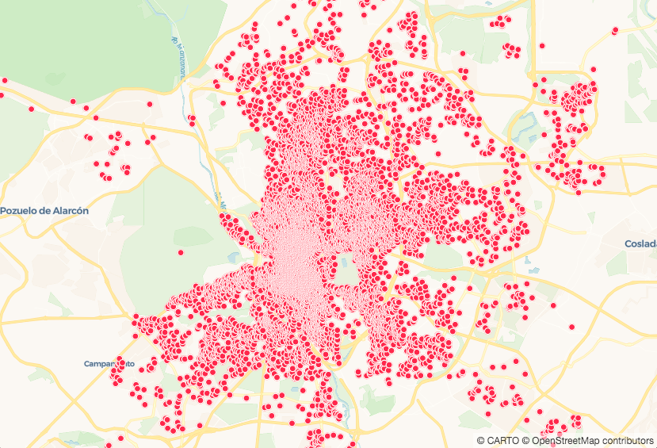
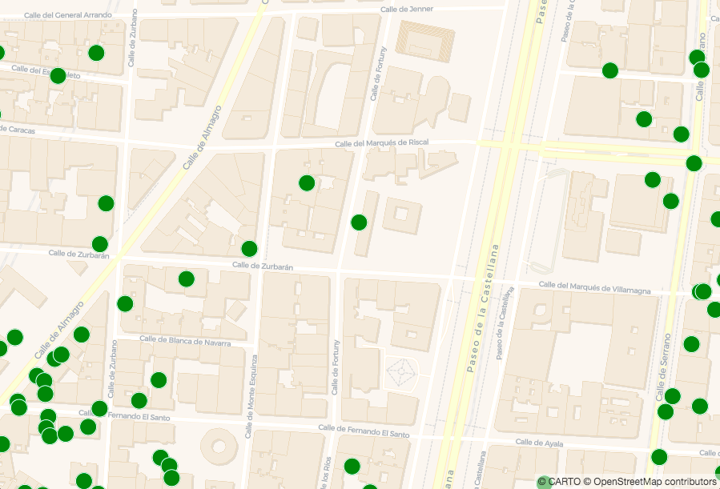

# Getting Started

*In this section we're going to create a basic CARTO VL map. Take the next steps to set up a basemap and data layer, & view them in your browser.*

*For more help check out our Developer Center's Getting Started documentation [here](https://carto.com/developers/carto-vl/guides/getting-started/).*

## Prerequisites

* A computer with a code editor
  * Notepad (Windows default)
  * TextEdit (Mac default)
  * [Sublime Text](https://www.sublimetext.com/)
  * [Atom](https://atom.io/)

## <a name="steps1">Steps</a>

 1. [Create a Basic HTML Template](#createTemplate1)
 2. [Include Mapbox GL and CARTO VL Scripts](#includeMapbox)
 3. [Add a Map Container and Basic CSS](#addContainer)
 4. [Set Up a Basemap with carto.basemaps](#setBmap)
 5. [Define the User](#defineUser)
 6. [Define the Source](#defineSrc)
 7. [Define the Viz](#defineViz)
 8. [Define the Layer](#defineLayer)
 9. [Add the Layer to the Map](#addLayer)
 10. [Start Playing with the Visualization](#startViz)


## <a name="createTemplate1">Create a Basic HTML Template</a>

Open a new document in your code editor, then paste this into it:

```html
<!DOCTYPE html>
<html>

<head>
  <title>CARTO VL Training</title>
  <meta name="viewport" content="width=device-width, initial-scale=1.0">
  <meta charset="UTF-8">
</head>

<body>
</body>

</html>
```

[Back to Steps List ^](#steps1)

## <a name="includeMapbox">Include Mapbox GL and CARTO VL Scripts</a>

We need to add JavaScript libraries to our HTML document in order to build our map. Add these lines of code nested in your `head` element, under `<meta charset="UTF-8">`:

```html
<!-- Include CARTO VL JS from the CARTO CDN-->
<script src="https://libs.cartocdn.com/carto-vl/v1.0.0/carto-vl.min.js"></script>
<!-- Include Mapbox GL from the Mapbox CDN-->
<script src="https://api.tiles.mapbox.com/mapbox-gl-js/v0.50.0/mapbox-gl.js"></script>
<link href="https://api.tiles.mapbox.com/mapbox-gl-js/v0.50.0/mapbox-gl.css" rel="stylesheet" />
<!-- Include CARTO styles-->
<link href="https://carto.com/developers/carto-vl/examples/maps/style.css" rel="stylesheet">
```

**WHY MAPBOX GL?**

* Notice we are including both Mapbox GL JavaScript and style libraries.
* CARTO VL uses [Mapbox GL](https://www.mapbox.com/mapbox-gl-js/api/) to render basemaps.
* We will use CARTO VL code to add CARTO data layers over the basemap, but because the Mapbox GL libraries are included you also have the option to add native Mapbox data layers to your map.
* CARTO VL expressions cannot be used for native Mapbox GL layers and vice versa.

[Back to Steps List ^](#steps1)

## <a name="addContainer">Add a Map Container and Basic CSS</a>

We need an HTML element for JavaScript to draw our map in. Add this line in between the `<body></body>` tags:

```html
<div id="map"></div>
```

We will pass this element's `id` to our JavaScript code later as the map's container.

Define styles for the container by pasting this inside the `head` element. This will make sure our map fills the browser window.

```html
<style>
  body {
    margin: 0;
    padding: 0;
  }

  #map {
    position: absolute;
    width: 100%;
    height: 100%;
  }
</style>
```

[Back to Steps List ^](#steps1)

## <a name="setBmap">Set Up a Basemap with carto.basemaps</a>

Add this script element under your container `div`:

```html
<script>
  const map = new mapboxgl.Map({
    container: 'map',
    style: carto.basemaps.voyager,
    center: [-3.6908, 40.4297],
    zoom: 11
  });
</script>
```

* `const map = new mapboxgl.Map` gives us a map object. This will contain our visualization.
* `container: 'map',` puts our map object in this HTML element: `<div id="map"></div>`.
* `style: carto.basemaps.voyager` defines which basemap to use, without needing a specific url. You also have two other basemaps to choose from:
  * `carto.basemaps.positron`
  * `carto.basemaps.darkmatter`
* `center: [-3.6908, 40.4297]` will center your map on these coordinates.
* `zoom: 11` displays the map at this default zoom level when it loads.

Save this file as `index.html` on your computer. At this point your code should look like this:

```html
<!DOCTYPE html>
<html>

<head>
  <title>CARTO VL Training</title>
  <meta name="viewport" content="width=device-width, initial-scale=1.0">
  <meta charset="UTF-8">
  <!-- Include CARTO VL JS from the CARTO CDN-->
  <script src="https://libs.cartocdn.com/carto-vl/v1.0.0/carto-vl.min.js"></script>
  <!-- Include Mapbox GL from the Mapbox CDN-->
  <script src="https://api.tiles.mapbox.com/mapbox-gl-js/v0.50.0/mapbox-gl.js"></script>
  <link href="https://api.tiles.mapbox.com/mapbox-gl-js/v0.50.0/mapbox-gl.css" rel="stylesheet" />
  <!-- Include CARTO styles-->
  <link href="https://carto.com/developers/carto-vl/examples/maps/style.css" rel="stylesheet">
  <style>
    body {
      margin: 0;
      padding: 0;
    }

    #map {
      position: absolute;
      width: 100%;
      height: 100%;
    }
  </style>
</head>

<body>
  <div id="map"></div>

  <script>
    const map = new mapboxgl.Map({
      container: 'map',
      style: carto.basemaps.voyager,
      center: [-3.6908, 40.4297],
      zoom: 11
    });
  </script>
</body>

</html>
```

*Open `index.html` in your web browser. Now you should see this:*


To see another example of the steps above, check [this Basic setup guide](https://carto.com/developers/carto-vl/guides/getting-started/#basic-setup).

[Back to Steps List ^](#steps1)

## <a name="defineUser">Define the User</a>

To add other layers on top of the basemap we need access to CARTO datasets. In this example we will use a CARTO account's [public](https://carto.com/help/building-maps/privacy-settings-for-protecting-maps-and-data/) dataset of Madrid rental listings.

Because data privacy is important at CARTO, authentication is required. We use api keys for that. Find out more about how CARTO authentication works [here](https://carto.com/developers/fundamentals/authorization/).

In this step we will [define a user](https://carto.com/developers/carto-vl/guides/getting-started/#define-user) account to get data from, and specify the API key that gives us account access. Add this code block beneath `map.addControl(nav, 'top-left');`:

```javascript
carto.setDefaultAuth({
  username: 'cartovl',
  apiKey: 'default_public'
});
```

* `username` is the name of the CARTO account that contains our data.
* The `default_public` key gives a CARTO VL app access to all of an account's public datasets.
* You can add a code block like this to your app more than once, so you can pull data from more than one CARTO account into the same map.

[Back to Steps List ^](#steps1)

## <a name="defineSrc">Define the Source</a>

Now that we have access to a CARTO account we can use it's data in this map by [defining a `source`](https://carto.com/developers/carto-vl/guides/getting-started/#create-source). CARTO VL provides a few ways to bring data into your map that we will demonstrate in the next section. One of those methods gets an entire dataset by name. Add this line beneath the `setDefaultAuth` block:

```javascript
const source = new carto.source.Dataset('madrid_listings');
```

* You can add more than one source to a map.
* Make sure to give each source `const` a unique name

[Back to Steps List ^](#steps1)

## <a name="defineViz">Define the Viz</a>

This data won't show up on the map until we tell the browser how to render it. We do that by defining style properties inside a [Viz object](https://carto.com/developers/carto-vl/reference/#cartoviz). Add this line beneath the source:

```javascript
const viz = new carto.Viz();
```

* When the [Viz object](https://carto.com/developers/carto-vl/guides/getting-started/#create-viz-object) is empty like this, our system will apply default styles.
* If you are using multiple sources, you need to create a separate Viz object for each one.
  * Make sure the Viz object `const` are named uniquely.

[Back to Steps List ^](#steps1)

## <a name="defineLayer">Define the Layer</a>

Now we can [create a new map layer](https://carto.com/developers/carto-vl/guides/getting-started/#create-map-layer) using the data source and style definitions. Add this beneath the viz definition:

```javascript
const layer = new carto.Layer('layer', source, viz);
```

* There can only be one source and Viz object per layer, but you can create more than one layer. Just define a new carto.Layer `const` for each and make sure they are named uniquely.
* The first function parameter defines a layer's name. You can use whatever name you'd like, here we're using `'layer'`
* The second parameter is always the name of the source `const` you defined previously, and the third parameter is always the name of the Viz object `const`.

[Back to Steps List ^](#steps1)

## <a name="addLayer">Add the Layer to the Map</a>

[Add the layer](https://carto.com/developers/carto-vl/guides/getting-started/#add-map-layer) to the map object this way:

```javascript
layer.addTo(map);
```

Notice we're using the `mapboxgl.Map` object's `const` name, not the containing div element's `"map"` id.

When you save these changes in your code editor and refresh your browser, the map should look like this:



[Back to Steps List ^](#steps1)

## <a name="startViz">Start Playing with the Visualization</a>

Let's change the default style by [adding our own style rules](https://carto.com/developers/carto-vl/guides/getting-started/#defining-a-custom-style-for-the-viz-object). CARTO VL offers powerful data-driven styling with expressions, which we will cover later. For now we can make simple marker size and color changes by adding properties to the Viz object:

```javascript
const viz = new carto.Viz(`
  color: green
  width: 20
`);
```

In CARTO.js and Builder maps styles are defined differently. Builder maps require CartoCSS. For example, to change a point's color you would use:

```css
marker-fill: "green";
```

To change a polygon's color with CartoCSS you would use:

```css
polygon-fill: "green";
```

Notice that we don't need to use geometry-specific properties in CARTO VL.

CARTO uses two types of Visualization API's to define our Viz properties: String and JavaScript. Learn more about those [here](https://carto.com/developers/carto-vl/guides/style-with-expressions/#the-string-and-javascript-visualization-apis). The back-ticks we're using inside the Viz function indicate we're using the String Visualization API in this map.

At this point your code should look like this:

```html
<!DOCTYPE html>
<html>

<head>
  <title>CARTO VL training</title>
  <meta name="viewport" content="width=device-width, initial-scale=1.0">
  <meta charset="UTF-8">
  <!-- Mapbox GL -->
  <link href="https://api.tiles.mapbox.com/mapbox-gl-js/v0.50.0-beta.1/mapbox-gl.css" rel="stylesheet" />
  <script src="https://api.tiles.mapbox.com/mapbox-gl-js/v0.50.0-beta.1/mapbox-gl.js"></script>
  <!-- CARTO VL JS -->
  <script src="https://libs.cartocdn.com/carto-vl/v0.9.1/carto-vl.min.js"></script>
  <style>
    body {
      margin: 0;
      padding: 0;
    }

    #map {
      position: absolute;
      width: 100%;
      height: 100%;
    }
  </style>
</head>

<body>
  <div id="map"></div>

  <script>
    const map = new mapboxgl.Map({
      container: 'map',
      style: carto.basemaps.voyager,
      center: [-3.6908, 40.4297],
      zoom: 11
    });

    carto.setDefaultAuth({
      user: 'cartovl',
      apiKey: 'default_public'
    });

    const source = new carto.source.Dataset('madrid_listings');
    const viz = new carto.Viz(`
      color: green
      width: 20
    `);
    const layer = new carto.Layer('layer', source, viz);

    layer.addTo(map);
  </script>
</body>

</html>
```

Now when you save the latest changes and refresh, you should see larger green markers representing your points.

*One of the benefits of using CARTO VL is that you can use fractional zoom levels. We modified the map object's zoom level to 16.2, then refreshed to see this:*



For another code example of a basic map, check [this section](https://carto.com/developers/carto-vl/guides/getting-started/#all-together) of our Developer Center guide.

[Back to Steps List ^](#steps1)
