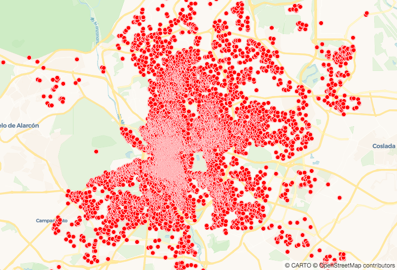
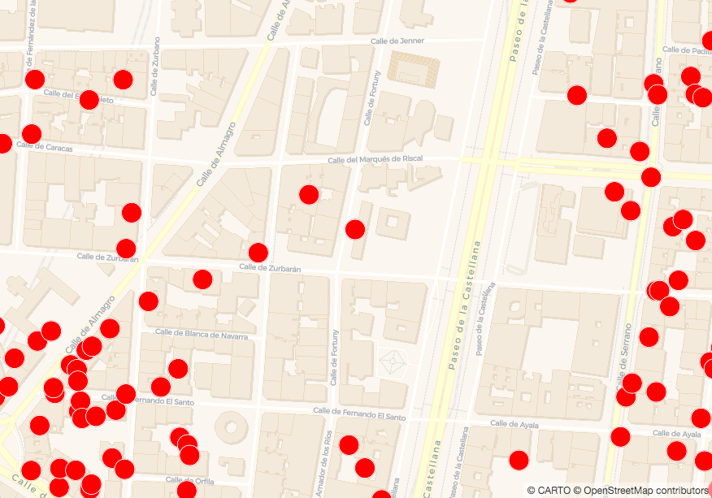
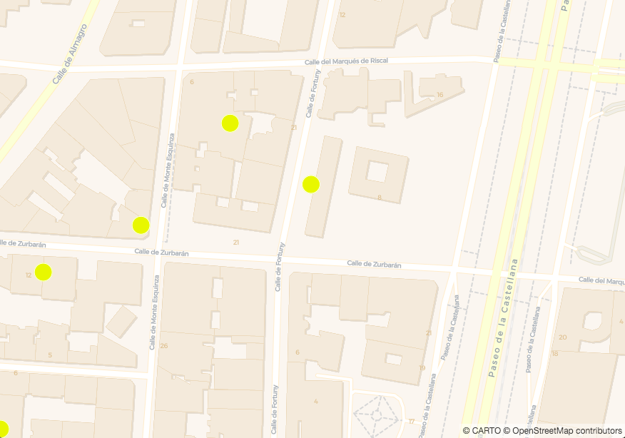
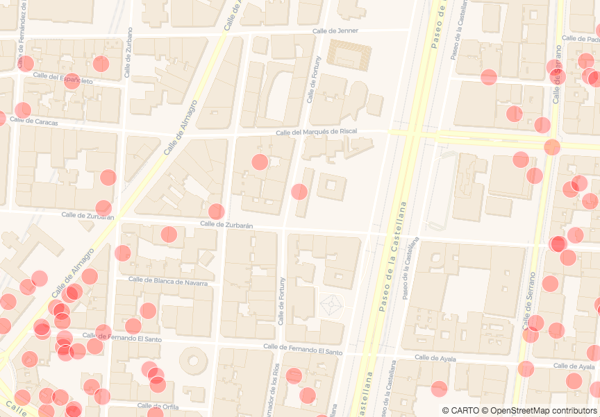
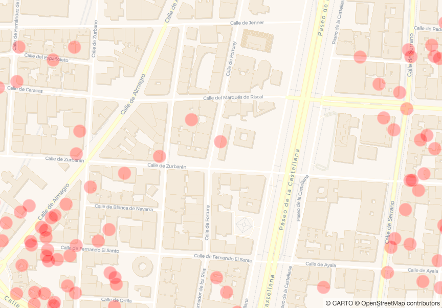
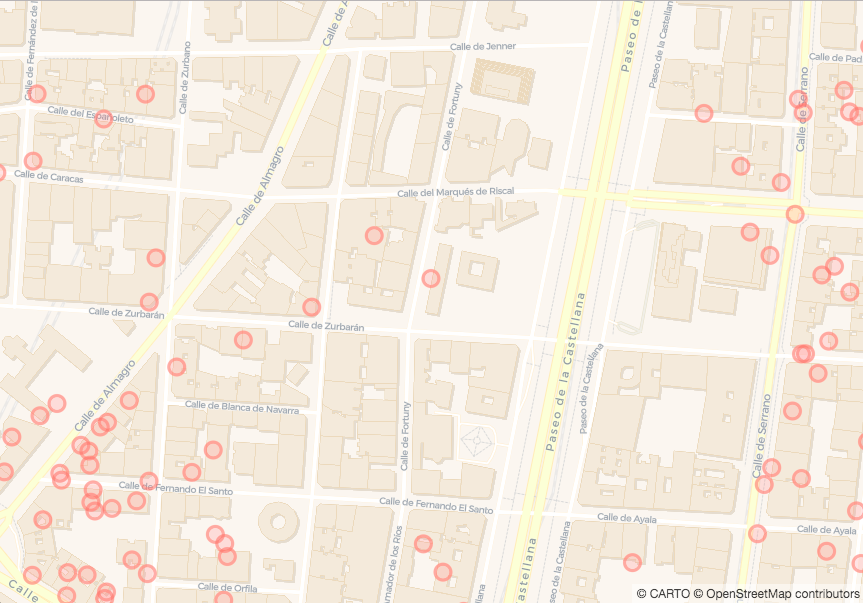

# Styling Properties Using Expressions

*Every feature in your map's data layer has properties like width and/or color. Check out all of the properties available, and which of them apply to points, lines or polygons [here](https://carto.com/developers/carto-vl/reference/#cartoexpressions). We also have an interactive map to let you explore property differences between geometries [in this guide](https://carto.com/developers/carto-vl/guides/style-with-expressions/).*

*How you choose to style these has a big effect on how legible your map is. CARTO VL offers great flexibility for defining your styles, because it allows you to use expressions.*

## Steps

 1. [Expressions](#expressions)
 2. [Create a Basic Viz with Custom Styles](#createTemplate3)
 3. [Add an Expression Function](#expressionFunction)
 4. [Add a Color Expression Function](#addColorExp)
 5. [Opacity](#opacity)
   5.A [Option A](#opacityA)
   5.B [Option B](#opacityB)
   5.C [Option C](#opacityC)

## <a name="expressions">Expressions</a>
Expressions can be static values, like `red` or `#63ECF0`.

Expressions can also be functions. Functions take an input, use it in some kind of calculation or transformation, and output another value. This value is used to define your style. Some of these are math functions that you might have heard of before, like `sqrt()`.

CARTO VL expressions can be other types of functions though, including ones that work with color values.

You can also combine expressions using *expression functions*.
* An expression example = `sqrt(9)`
* An expression function example = `sqrt(9) + cos(10)`

Check [this guide](https://carto.com/developers/carto-vl/guides/style-with-expressions/#what-is-an-expression) for a more detailed explanation of expressions. You can find a list of CARTO VL expressions and expression functions [here](https://carto.com/developers/carto-vl/reference/#cartoexpressions).

In this section we're going to demonstrate a few kinds of expressions.

## <a name="createTemplate3">Create a Basic Viz with Custom Styles</a>
Let's create a new map. Replace all of the code in your `index.html` file with this:

```html
<!DOCTYPE html>
<html>

<head>
  <title>CARTO VL Training</title>
  <meta name="viewport" content="width=device-width, initial-scale=1.0">
  <meta charset="UTF-8">
  <!-- Include CARTO VL JS from the CARTO CDN-->
  <script src="https://libs.cartocdn.com/carto-vl/v1.0.0/carto-vl.min.js"></script>
  <!-- Include Mapbox GL from the Mapbox CDN-->
  <script src="https://api.tiles.mapbox.com/mapbox-gl-js/v0.50.0/mapbox-gl.js"></script>
  <link href="https://api.tiles.mapbox.com/mapbox-gl-js/v0.50.0/mapbox-gl.css" rel="stylesheet" />
  <!-- Include CARTO styles-->
  <link href="https://carto.com/developers/carto-vl/examples/maps/style.css" rel="stylesheet">
  <style>
    body {
      margin: 0;
      padding: 0;
    }

    #map {
      position: absolute;
      width: 100%;
      height: 100%;
    }
  </style>
</head>

<body>
  <div id="map"></div>

  <script>
    const map = new mapboxgl.Map({
      container: 'map',
      style: carto.basemaps.voyager,
      center: [-3.6908, 40.4297],
      zoom: 11
    });

    carto.setDefaultAuth({
      user: 'cartovl',
      apiKey: 'default_public'
    });

    const source = new carto.source.Dataset('madrid_listings');
    const viz = new carto.Viz(`
      width: 8
      color: red
    `);
    const layer = new carto.Layer('layer', source, viz);

    layer.addTo(map);
  </script>
</body>

</html>
```

If we used an empty `viz` like this: `const viz = new carto.Viz();` the map would render with default CARTO styles. Since we're defining a color and width property inside the `viz` object, we're adding custom styles.

*When you open this in a browser, your map should look like this:*




## <a name="expressionFunction">Add an Expression Function</a>

Take a look at how width is defined in the `viz` object. It's telling our system to draw point markers that are 8 pixels wide. We can use an *expression function* here instead. Replace the current width property with this:

```javascript
width: 8 + 16
```

*Now when you save and refresh the map, the points should be 24 pixels wide. We zoomed into level 16 in this screenshot:*




## <a name="addColorExp">Add a Color Expression Function</a>

CARTO VL offers [a few ways to define color using different expressions](https://carto.com/developers/carto-vl/guides/style-with-expressions/#color-expressions). One type of expression is a `color constructor`, which is a function that defines a color by the components of its [color space](https://photo.stackexchange.com/questions/48984/what-is-the-difference-or-relation-between-a-color-model-and-a-color-space). 

For example, this [RGB](https://carto.com/developers/carto-vl/reference/#cartoexpressionsrgb) color constructor specifies values for red, green and blue color channels that result in the color <span style="color:#885cff">purple</span>: `rgb(136, 92, 255)`. 
* You can find constructors for other color spaces in [our documentation](https://carto.com/developers/carto-vl/reference/), like [CIELab](https://carto.com/developers/carto-vl/reference/#cartoexpressionscielab) and [HSL](https://carto.com/developers/carto-vl/reference/#cartoexpressionshsl).

Just like with other expressions, we can combine `color constructor` expressions together with an `expression function`. Replace your `viz` object's current color property with this:

```javascript
color: rgb(239, 0, 0) + rgb(0, 239, 0)
```

The color channel values get added together, so the final result is `rgb(239, 239, 0)`. That makes our markers yellow.

*We zoomed into level 17 in this screenshot. Notice how the point size stays 24 pixels wide no matter which zoom level you're at.*



## <a name="opacity">Opacity</a>

Sometimes you might want to make your map features semi-transparent, so overlapped features or basemap details can appear underneath. This is also possible with expressions. 

### <a name="opacityA">OPTION A</a>

One way is to use a color constructor that contains a value for the alpha channel, like this:

* Put two forward slashes in front of the color property you just used. This "comments out" that code line, so it's not read when the page loads.

```javascript
//color: rgb(239, 0, 0) + rgb(0, 239, 0)
```

* In a new line underneath the comment, type this:

```javascript
color: rgba(255, 0, 0, 0.25)
```

The fourth parameter defines how transparent the color is when it renders. A value of 1 is completely opaque. A value of 0 is completely transparent.



### <a name="opacityB">OPTION B</a>

We can get the same effect using a CARTO VL function: [opacity()](https://carto.com/developers/carto-vl/reference/#cartoexpressionsopacity). Comment out the code line you just implemented, and write this underneath:

```javascript
color: opacity(rgb(255, 0, 0) 0.25)
```


### <a name="opacityC">OPTION C</a>

Another option is to use a CARTO VL property called [filter](https://carto.com/developers/carto-vl/reference/#cartoexpressions). Filter is a method we use to set a condition. In the example below it's being used to set the map layer's features to 25% opacity. Comment out the last code line and add the `color` and `filter` properties shown below:
    
```javascript
const viz = new carto.Viz(`
  width: 8 + 16
            
  // Option A
  color: rgba(255, 0, 0, 0.25)
            
  // Option B
  // color: opacity(rgb(255, 0, 0) 0.25)
            
  // Option C
  color: red
  filter: 0.25
`);
```



What's the difference between using `filter` and the other opacity methods? 
* Filter changes opacity for the whole layer. 
* The opacity function or a color expression alpha channel can do that too, but they can also be applied to specific features. That means for example you can have the whole layer at 80% opacity, but at the same time you can make a point marker's fill color less transparent than it's stroke color. 

```javascript
const viz = new carto.Viz(`
  width: 15
  color: rgba(240, 128, 128, 0.2)
  strokeColor: salmon
  strokeWidth: 3
  filter: 0.5
`);
```



We'll learn more about styling features differently from each other in the next section.
