# Introduction to Ramps and Data-Driven Visualizations

*The main goal when styling your map is to illustrate an insight from your data. You can do that by changing a feature's properties according to the data it represents. For example, you can change a feature's color or size according to one (or more) data attributes.*

*CARTO VL offers functions that do the work of styling features by attribute behind-the-scenes. In this section we'll demonstrate how, but for more detailed information see our Data Driven Styling guides [Part 1](https://carto.com/developers/carto-vl/guides/data-driven-visualizations-part-1/) and [Part 2](https://carto.com/developers/carto-vl/guides/data-driven-visualizations-part-2/).*

## Steps

 1. [Create a Basic Map](#createTemplate4)
 2. [Ramp and Numeric Properties](#rampNumeric)
 3. [Improve the Style](#improveStyle)
 4. [Classify a Numeric Property for Better Perception](#classifyNumeric)
 5. [The `Others` Category](#others)
 6. [Find the Most Common Categories](#mostCommon)
 7. [Showing All Categories for Exploratory Analysis](#showCats)
 8. [CARTOColors](#cartoColors)
 9. [Create a Bubble Map](#bubbleMap)
 10. [Size Perception](#sizePerception)
 11. [Introducing Symbols and Images](#imageSymbols)

## <a name="createTemplate4">Create a Basic Map</a>
For this section let's start with a map of UK elections. Leave the `viz` object empty for this step:

```html
<!DOCTYPE html>
<html>

<head>
  <title>CARTO VL Training</title>
  <meta name="viewport" content="width=device-width, initial-scale=1.0">
  <meta charset="UTF-8">
  <!-- Include CARTO VL JS from the CARTO CDN-->
  <script src="https://libs.cartocdn.com/carto-vl/v1.0.0/carto-vl.min.js"></script>
  <!-- Include Mapbox GL from the Mapbox CDN-->
  <script src="https://api.tiles.mapbox.com/mapbox-gl-js/v0.50.0/mapbox-gl.js"></script>
  <link href="https://api.tiles.mapbox.com/mapbox-gl-js/v0.50.0/mapbox-gl.css" rel="stylesheet" />
  <!-- Include CARTO styles-->
  <link href="https://carto.com/developers/carto-vl/examples/maps/style.css" rel="stylesheet">
  <style>
    body {
      margin: 0;
      padding: 0;
    }

    #map {
      position: absolute;
      width: 100%;
      height: 100%;
    }
  </style>
</head>

<body>  
  <div id="map"></div>

  <script>
    const map = new mapboxgl.Map({
      container: 'map',
      style: carto.basemaps.darkmatter,
      center: [-3, 54.8],
      zoom: 4.5
    });

    carto.setDefaultAuth({
      user: 'cartovl',
      apiKey: 'default_public'
    });

    const source = new carto.source.Dataset('uk_elections');
    const viz = new carto.Viz();
    const layer = new carto.Layer('layer', source, viz);

    layer.addTo(map);
  </script>
</body>

</html>
```

*Now your map should show UK polygons in default CARTO styles:*

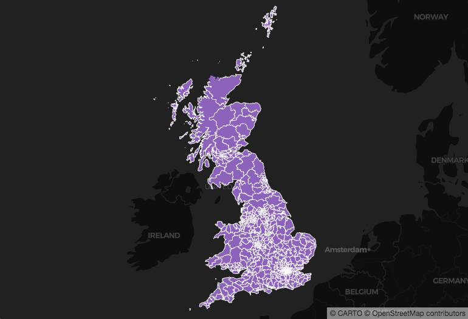

This is election data, and we'd like to show which party won the election in each area. Our dataset contains a string-type column named `winner`. For each polygon, the `winner` column lists the name of the political party that won there.

Since we know the names of the parties in that column, we can use them as categories. To show our map viewers who won, we can make [a *categorical* map](https://carto.com/developers/carto-vl/guides/data-driven-visualizations-part-1/#categorical-data): define a bucket (or bin) for each category. Then we can classify each polygon according to the bucket it belongs to.

CARTO VL offers [a ramp() function](https://carto.com/developers/carto-vl/reference/#cartoexpressionsramp) that will assign colors to categories for us. We just need to define the categories and colors first, using the [buckets() function](https://carto.com/developers/carto-vl/reference/#cartoexpressionsbuckets). Then we can use both functions inside an expression to define our map layer's color property. For a more detailed explanation of `ramp` check [this guide](https://carto.com/developers/carto-vl/guides/data-driven-visualizations-part-1/#what-is-a-ramp). 

Add a color and strokeColor to your `viz`:

```javascript
const viz = new carto.Viz(`
  color: ramp(buckets($winner, ["Conservative Party", "Labour Party"]), [blue, red])
  strokeColor: opacity(white, 0.6)
`);
```

* The first parameter in the `buckets` function is the name of the column containing our categories. [It needs to be prepended with a $](https://carto.com/developers/carto-vl/guides/style-with-expressions/#access-dataset-feature-properties).
* The second `buckets` parameter is an array of unique category names that are found in that column. Since we're working with text values they need to be enclosed in quotes.
* The `ramp` function takes the whole `buckets` function as it's first parameter. 
* The second `ramp` parameter is an array of colors. Their order corresponds with the order of our bucket categories, so `Conservative Party` polygons will be blue.
* We don't need quotes around [named colors](https://htmlcolorcodes.com/color-names/). 

*Now our map should look like this:*

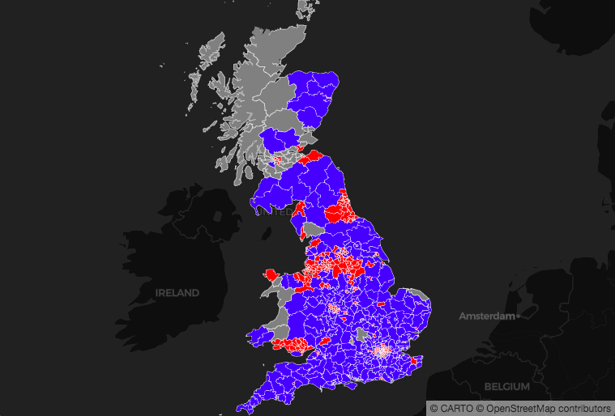

Check [this guide](https://carto.com/developers/carto-vl/guides/data-driven-visualizations-part-1/#categorical-data) for more information about creating data-driven visualizations with categorical data.

## <a name="rampNumeric">Ramp and Numeric Properties</a>

What happens if you want to color your features according to an attribute, but you have a large dataset and don't immediately know the range of values it's attribute column contains?

[Ramp can find them for you](https://carto.com/developers/carto-vl/guides/data-driven-visualizations-part-1/#what-is-a-ramp). To demonstrate this we'll make a new map. The new dataset we're using has numeric data: a column named `dn` that contains a population density value for each of it's point locations. Change the center and zoom in your map object's settings:

```javascript
const map = new mapboxgl.Map({
  container: 'map',
  style: carto.basemaps.darkmatter,
  center: [0, 40],
  zoom: 1
});
```

Replace your `source` and `viz` with this:

```javascript
const source = new carto.source.Dataset('pop_density_points');

const viz = new carto.Viz(`
  width: 2
  color: ramp($dn, [black, yellow])
  strokeWidth: 0
`);
```

Notice how we don't need to specify buckets in the color property's expression. 

When we don't specify buckets, we're creating an *unclassed map*. Each point is colored according to how much of an attribute it contains, instead of being put into a discrete category and given that category's assigned color.

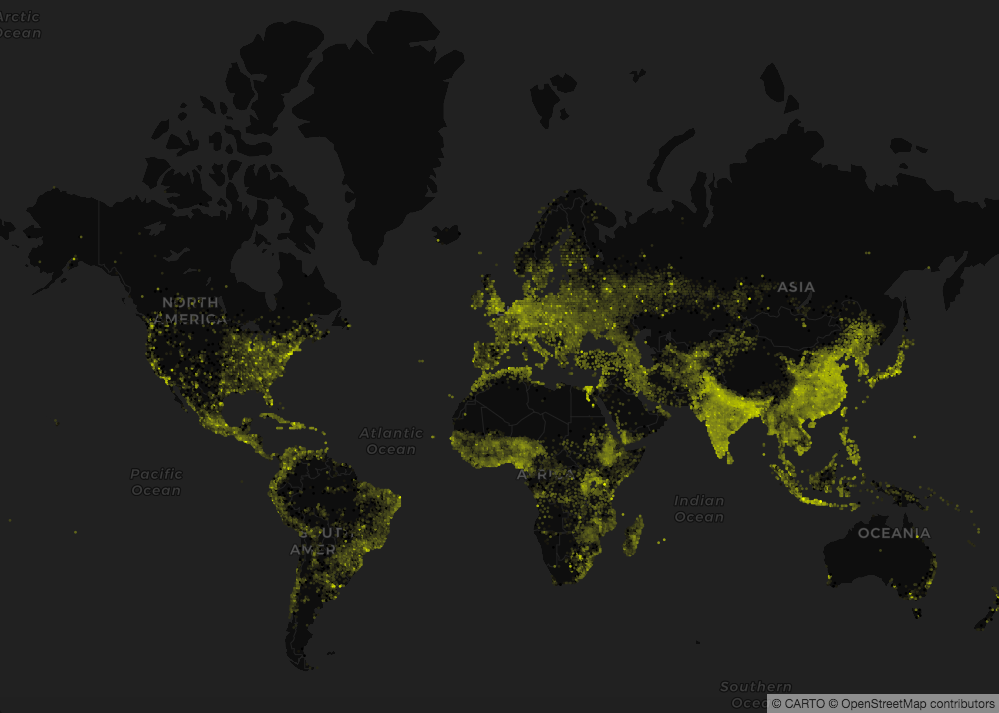
  
* The points with lowest population density are colored black, and the points with highest population density are colored yellow.
* But since this is an unclassed map, most points have values that fall between the lowest number and highest number. They are assigned a color that falls on a gradient between black and yellow. That's why we see gray points, and dark yellow points. 

Check [this guide](https://carto.com/developers/carto-vl/guides/data-driven-visualizations-part-1/#numeric-data) for more information about using `ramp` with numeric data. We're using named colors in this expression, but you can use [other color formats for data-driven styling](https://carto.com/developers/carto-vl/guides/data-driven-visualizations-part-2/#color-values).

## <a name="improveStyle">Improve the Style</a>

Our points with low population density are hard to see, since they are close to the same color as the basemap. We can make them more legible by changing the first value in our color `ramp`. We can also make it easier to see the places with mid-range population density by defining a third color in our `ramp` (you can define as many colors as you'd like). Replace the color property in your `viz` with this:

```javascript
color: ramp($dn, [green, yellow, red])
```

*Notice the difference:*

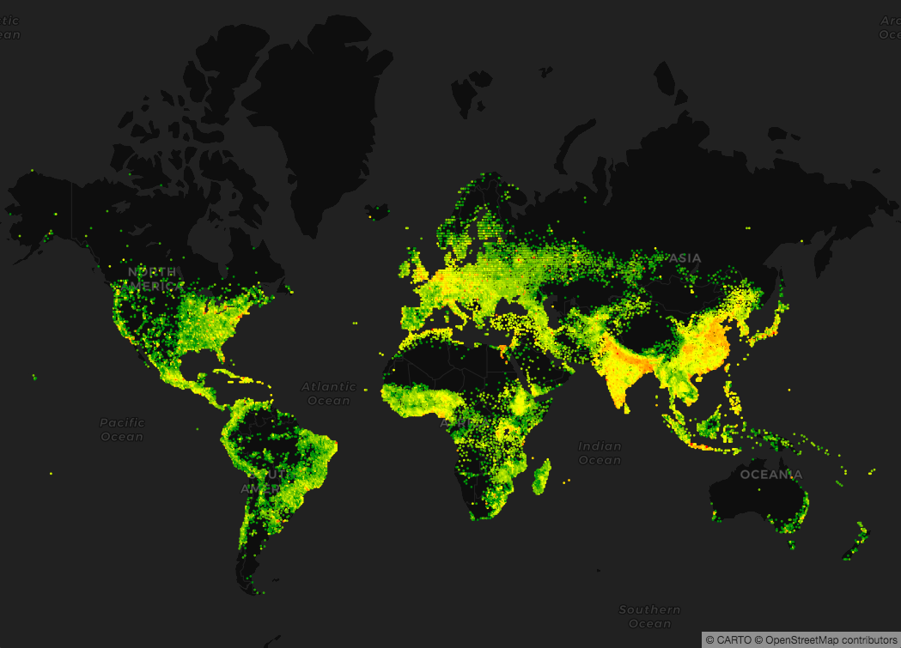


## <a name="classifyNumeric">Classify a Numeric Property for Better Perception</a>

What if we do want to put our attribute values into buckets, but we also want to make sure they're bucketed by a statistical classification method? The `ramp` function can do that automatically for us too. Replace your `viz` with this:

```javascript
const viz = new carto.Viz(`
  width: 1.5
  color: ramp(globalQuantiles($dn, 3), [green, yellow, red])
  strokeWidth: 0
`);
```

* Notice we're using a function for the `ramp` function's first parameter: `globalQuantiles($dn, 3)`
  * check our documentation for other available classification types, like Standard Deviation: [globalStandardDev](https://carto.com/developers/carto-vl/reference/#cartoexpressionsglobalstandarddev)
* The [globalQuantiles function](https://carto.com/developers/carto-vl/reference/#cartoexpressionsglobalquantiles) takes two parameters: the column containing the data, and the number of buckets you want to divide the data into.
* `global` is important here. That means all of the data in this map is being considered during the classification calculation. That's different than [viewportQuantiles](https://carto.com/developers/carto-vl/reference/#cartoexpressionsviewportquantiles). 
* The `viewportQuantiles` function only uses a subset of your data. 
  * The subset can be all of the data in your map's viewport. That means your data gets re-bucketed as you zoom in and out of the map, because on zoom more or less data is contained in the viewport.
  * You can also define the subset of data using [filter](https://carto.com/developers/carto-vl/reference/#cartoexpressionsclustertime).

*Once we save these changes our map looks like this:*

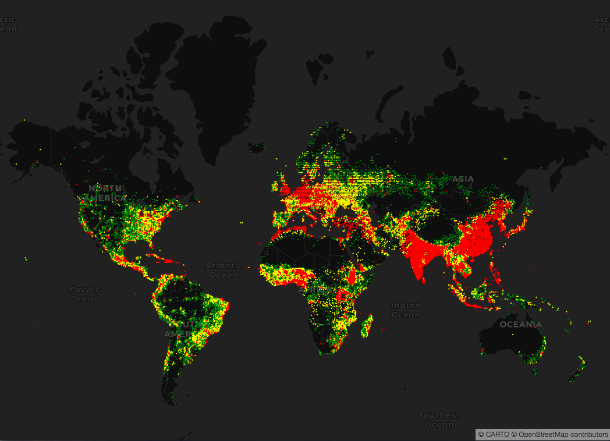


## <a name="others">The `Others` Category</a>
Sometimes you might only be interested in showing some categories, instead of all of them. CARTO VL lets you specify the categories you want, and bucket the rest into an "Other" category. "Other" is also helpful if you have some null values in your data. 

Let's use the election data again to illustrate this. Change your map object's zoom and center, change your source, and apply the style we used previously:

```javascript
const map = new mapboxgl.Map({
  container: 'map',
  style: carto.basemaps.darkmatter,
  center: [-3, 54.8],
  zoom: 4.5
});

const source = new carto.source.Dataset('uk_elections');

const viz = new carto.Viz(`
  color: ramp(buckets($winner, ["Conservative Party", "Labour Party"]), [blue, red])
  strokeColor: opacity(white, 0.6)
`);
```

Notice that we've only specified blue and red colors in the `color` expression. That works for identifying the polygons where the Labour Party or the Conservative Party won, but we have some polygons where neither of those parties won (or there wasn't any winning party data). 

Our system categorizes these polygons as "Other", and automatically gives them a gray color. We can change that though. You can use an optional third parameter in the buckets function to pick a color for the "Other" category, like white. Update the `color` property to this:

```javascript
color: ramp(buckets($winner, ["Conservative Party", "Labour Party"]), [blue, red], white)
```

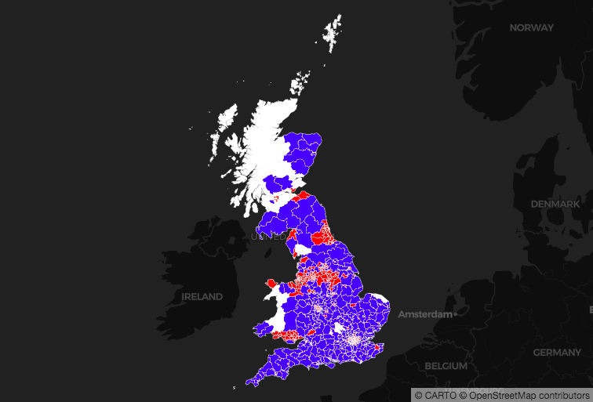


## <a name="mostCommon">Find the Most Common Categories</a>

CARTO VL also helps you find the most common categories in your attribute column. This is a quick way to explore data you're unfamiliar with, and a quick way to get valuable insight from it. For example it lets us easily find the most common type of accident in a USA railroad dataset. Change your map object and source:

```javascript
const map = new mapboxgl.Map({
  container: 'map',
  style: carto.basemaps.darkmatter,
  center: [-96, 41],
  zoom: 3
});

const source = new carto.source.Dataset('dot_rail_safety_data');
```

Change your style:

```javascript
const viz = new carto.Viz(`
  width: 10
  strokeWidth: 0.2
  color: ramp(top($accident_type, 3), [#3969AC, #F2B701, #E73F74], #A5AA99)
`);
```

We're not specifying categories by name here, since we don't know ahead of time what types of accidents are in this dataset. We don't need to! The top function takes two parameters:
* The name of the column containing our categories, prepended with a `$`.
* The number of top categories we want to find. Here we're finding the top 3 most common railroad accidents.
* The `ramp` function takes the `top` function as it's first parameter. The other two `ramp` function parameters are ones we saw earlier: 
  * An array of colors, one for each of our 3 categories
  * A color for our "Other" category. All categories that are not one of the top 3 are considered "Other".

*Here's how the top 3 categories are visualized according to our color expression (we've zoomed into the NorthWest):*

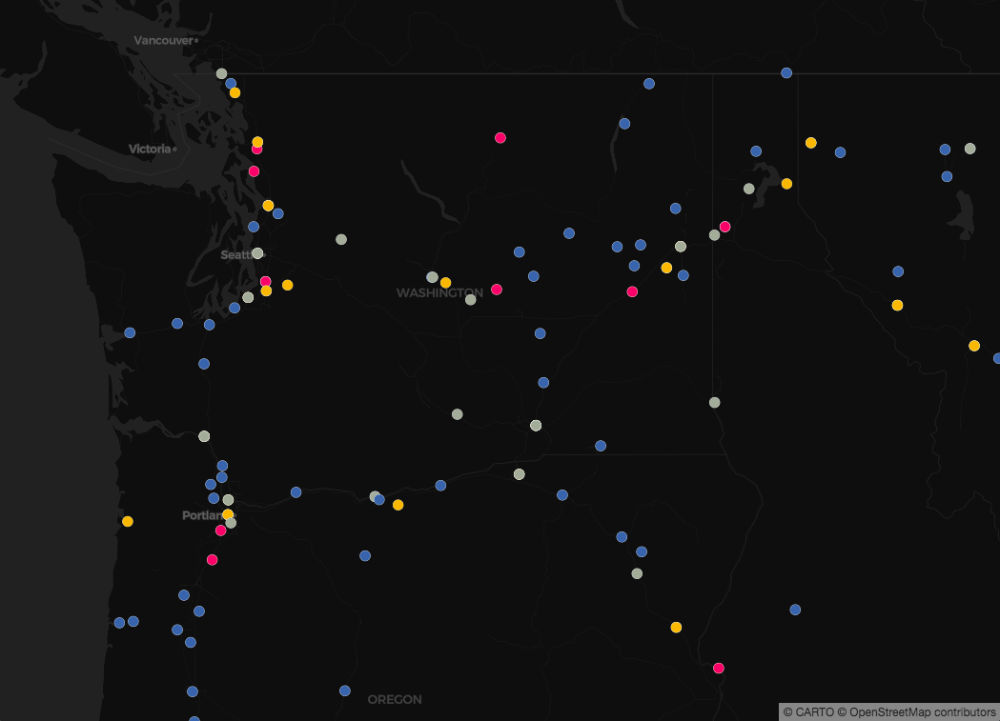


## <a name="showCats">Showing All Categories for Exploratory Analysis</a>

You can also use CARTO VL to explore all the categories that are in your attribute column, instead of just the top ones. Change your `color` property to this:

```css
color: ramp($accident_type, [#7F3C8D, #11A579, #3969AC, #F2B701, #E73F74, #80BA5A])
```

Notice we don't need to specify an accident type or the number of categories we want to visualize. The number of categories is taken from the number of colors we define in the `ramp` function's second parameter. This will detect the six categories, and any others will be bucketed into "Other". 
* We haven't defined a color for "Other", so it will be gray by default. 
* These categories have no hierarchy. They are also not necessarily the most common.

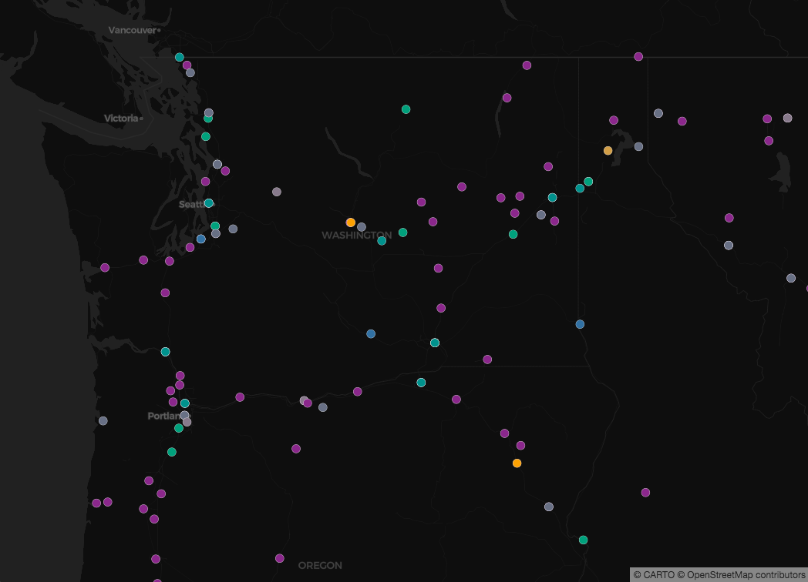

## <a name="cartoColors">CARTOColors</a>

CARTO provides cartographer-designed color palettes called CARTOColors. They were optimized to work with a variety of data.
* Sequential schemes for orderable or numeric data.
* Diverging schemes to highlight a midpoint in your data, and show a hierarchy for values below and above that.
* Qualitative schemes to show categories, while making sure that they have equal importance.
  * Including a Safe palette for better visual accessibility

You can get our CARTOColors & find out more about them [here](https://carto.com/carto-colors/). They're also automatically available in CARTO VL by name. To see how, let's go back to our population density map. Change your map object and source.

```javascript
const map = new mapboxgl.Map({
  container: 'map',
  style: carto.basemaps.darkmatter,
  center: [0, 40],
  zoom: 1
});

const source = new carto.source.Dataset('pop_density_points');
```

Change your `viz` to this:

```javascript
const viz = new carto.Viz(`
  width: 2
  color: ramp($dn, temps)
  strokeWidth: 0
`);
```

**Temps** is the name of one of our Diverging CARTOColor schemes.

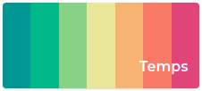

In this map it's highlighting places that have a mid-range population density with the color yellow. Places with lowest population density are blue-green. Places with highest population density are dark pink.

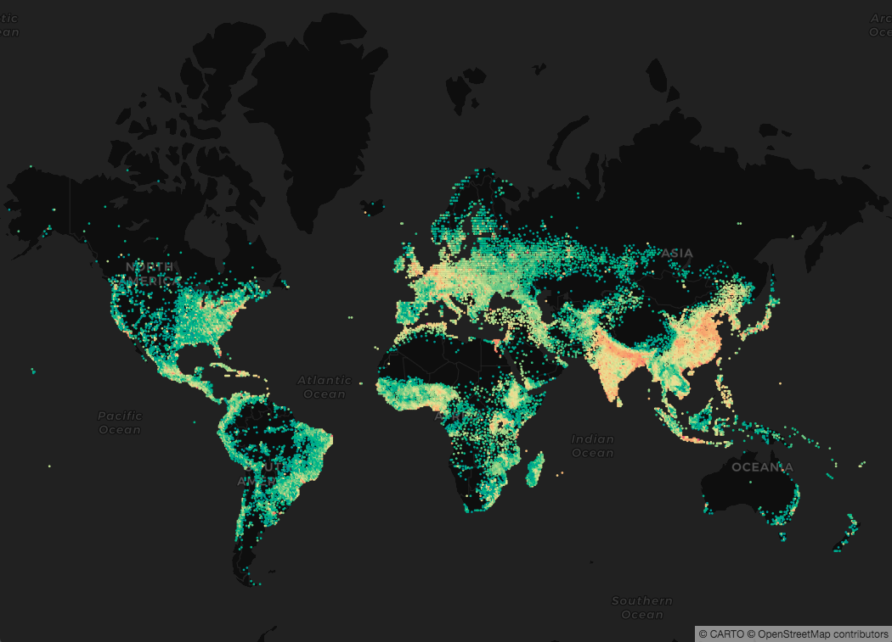

## <a name="bubbleMap">Create a Bubble Map</a>

In addition to color, we can use size to illustrate a second attribute. Let's make a bubble map. Re-load the rail safety data:

```javascript
const map = new mapboxgl.Map({
  container: 'map',
  style: carto.basemaps.darkmatter,
  center: [-96, 41],
  zoom: 3
});

const source = new carto.source.Dataset('dot_rail_safety_data');
```

Add a `color` expression to visualize the top 3 most common rail accidents:

```javascript
const viz = new carto.Viz(`
  strokeWidth: 0.2
  color: ramp(top($accident_type, 3), [#3969AC, #F2B701, #E73F74], #A5AA99)
`);
```

Now add this width property to the `viz`, to change the default point size:

```javascript
width: ramp($total_damage, [0, 50])
```

There's a number-type column named `total_damage` in the rail safety dataset. It contains the amount of damage the accident caused in dollars.

We're using `ramp` again, but here it sizes each point by how much damage (in dollars) it's accident caused. The more costly the damage the larger the point will be. The `ramp` function's second parameter is an array that defines our range of point sizes. 
* Accidents with the lowest amount of damage get a marker width of 0 pixels.
* Accidents with the highest amount of damage get a marker width of 50 pixels.

*Here's what the map looks when we zoom into North Carolina:*

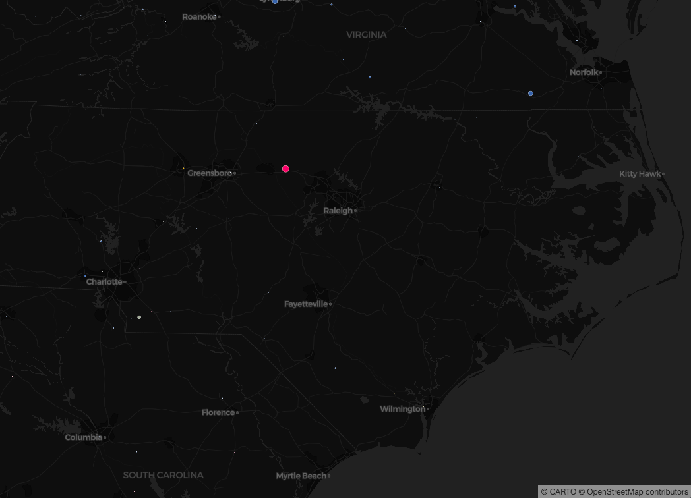

Some of the accidents are a little hard to see. We can improve that in the next step.

## <a name="sizePerception">Size Perception</a>

Right now our circle sizes are scaling up linearly. 

For example, let's say we have another dataset where the lowest `total_damage` is $0, and the highest is $100, a point with `total_damage` of $50 is halfway between them. 

Since lowest-damage points get a width of 0 and highest-damage points get a width of 50, the point with `total_damage` exactly halfway between those gets a width halfway between 0 and 50, or 25.

There's an issue with linear scaling though: we perceive changes in area, not changes in width. For a more detailed explanation see the `Size Perception` section [in this guide](https://carto.com/developers/carto-vl/guides/data-driven-visualizations-part-2/#numeric-values). We can make the differences between point damage values easier to recognize by changing the area, using an expression like this:

```javascript
width: sqrt(ramp($total_damage, [0, 50^2]))
```

* 50^2 = 50 squared.
* When we wrap the `ramp` inside a sqrt expression, an intermediate value with half the damage of the worst accident will get half the area of the worst damage value(50²/2), but not half its width.

*Now the sizes appear more normalized:*

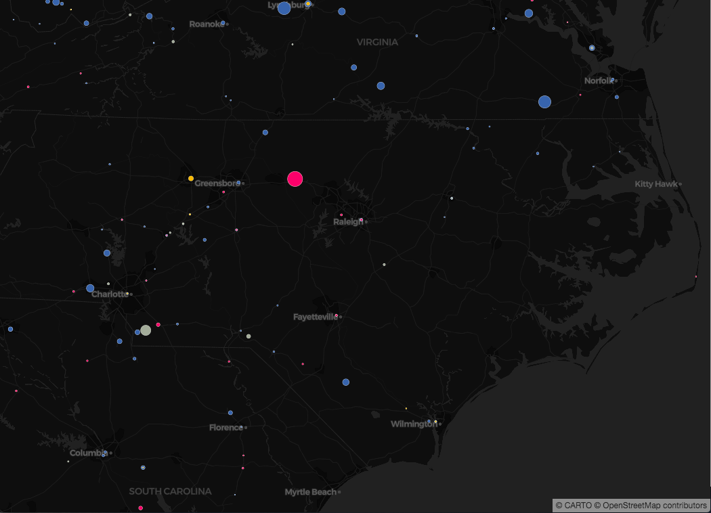

## <a name="imageSymbols">Introducing Symbols and Images</a>

Point markers don't need to be circles! You can use images instead. We have a guide for that [here](https://carto.com/developers/carto-vl/guides/data-driven-visualizations-part-2/#image-values). Add a `symbol` property to your `viz` like this:

```javascript
const viz = new carto.Viz(`
  width: sqrt(ramp($total_damage, [0, 50^2]))
  strokeWidth: 0.2
  color: ramp(top($accident_type, 3), [#3969AC, #F2B701, #E73F74], #A5AA99)
  symbol: ramp(top($accident_type, 3), [star, triangle, square])
`);
```

Just like in the other `ramp` functions we saw, the second parameter is an array of values. This time instead of colors we are using key words for [maki icons](https://www.mapbox.com/maki-icons/). 

Instead of maki icon key words you can use custom image urls. 
* The url needs to point to a publicly available .jpg, .png or .svg file.
* Put each url inside quotes.

*Here's what our map using maki icon key word symbols should look like (we zoomed into Montana):*

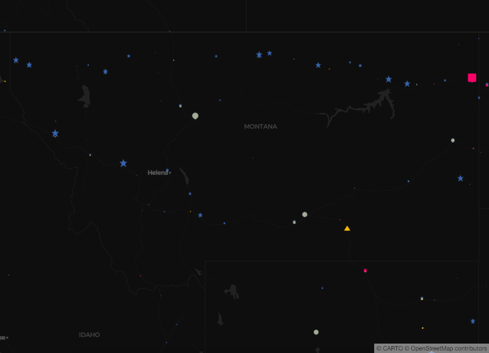
