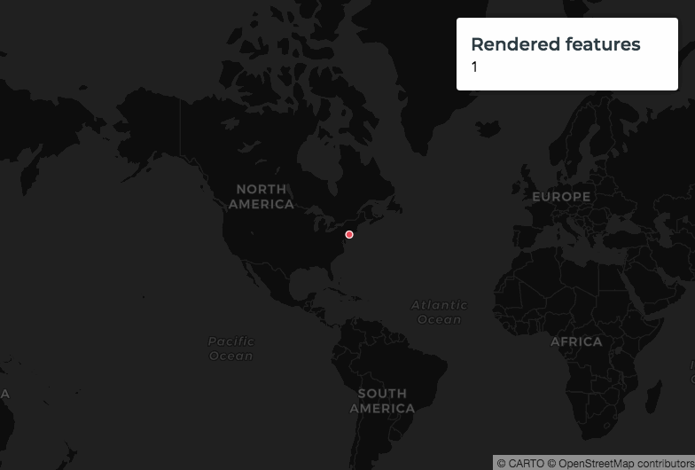
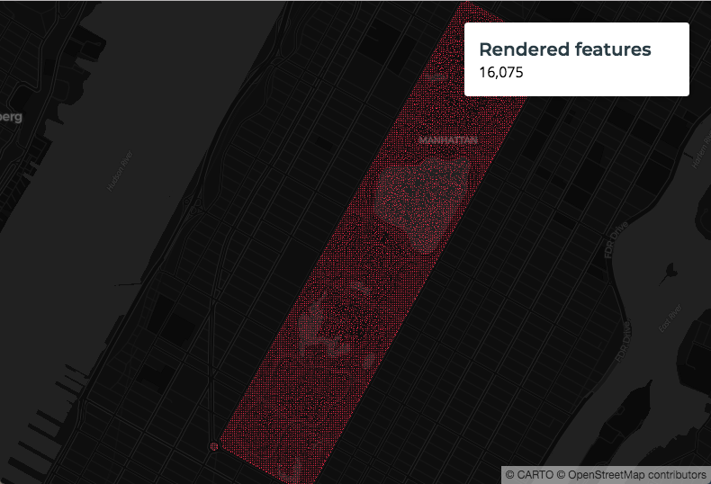
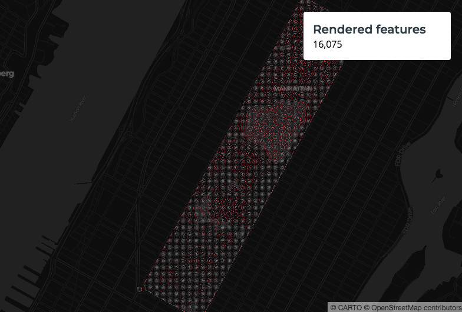
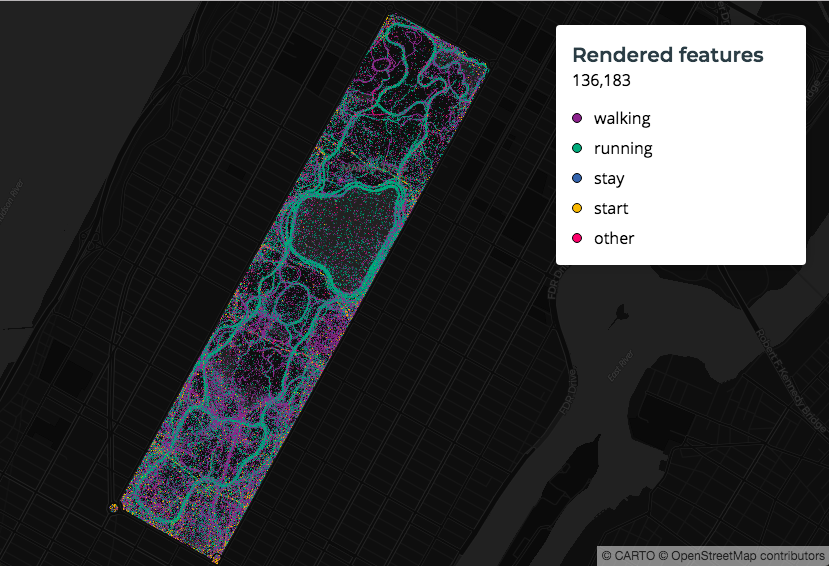

# Aggregation

*When your map has to render a large number of points that can impact it's performance. To make sure your maps perform efficiently CARTO VL performs auto-aggregation.*

*For example, at zoom levels where you wouldn't be able to see all of your points render properly because they overlap too closely, our system automatically aggregates the points so not all of them need to render. As you zoom in though more points are revealed.*

*In this section we will create a map from a large dataset, to check how auto-aggregation works.*

## Steps

 1. [Create a Basic Visualization with 350k Points](#createTemplate6)
 2. [Calculate the Features ](#calculateFeatures)
 3. [Improve the Visualisation Using a Basic Style](#improveVis)
 4. [Controlling the Resolution](#controlRes)
 5. [Improve Using Cluster Method](#clusterMethod)
 6. [Check the Velocity with Another Attribute](#checkVelocity)

## <a name="createTemplate6">Create a Basic Visualization with 350k Points</a>

Let's create a new map that uses anonymized data from over a million people that walked through Central Park in New York City:

```html
<!DOCTYPE html>
<html>

<head>
  <title>CARTO VL training</title>
  <meta name="viewport" content="width=device-width, initial-scale=1.0">
  <meta charset="UTF-8">
  <!-- Include CARTO VL JS from the CARTO CDN-->
  <script src="https://libs.cartocdn.com/carto-vl/v1.0.0/carto-vl.min.js"></script>
  <!-- Include Mapbox GL from the Mapbox CDN-->
  <script src="https://api.tiles.mapbox.com/mapbox-gl-js/v0.50.0/mapbox-gl.js"></script>
  <link href="https://api.tiles.mapbox.com/mapbox-gl-js/v0.50.0/mapbox-gl.css" rel="stylesheet" />
  <!-- Include CARTO styles-->
  <link href="https://carto.com/developers/carto-vl/examples/maps/style.css" rel="stylesheet">
</head>

<body>
  <div id="map"></div>

  <aside class="toolbox">
    <div class="box">
      <header>
        <h1>Rendered features</h1>
      </header>
      <section>
        <div id="controls">
          <div id="content"></div>
        </div>
      </section>
      <footer class="js-footer"></footer>
    </div>
  </aside>

  <script>
    const map = new mapboxgl.Map({
        container: 'map',
        style: carto.basemaps.darkmatter,
        center: [-73.9684, 40.7828],
        zoom: 1
    });

    carto.setDefaultAuth({
        user: 'cartovl',
        apiKey: 'default_public'
    });

    const source = new carto.source.Dataset('million_walks_central_park');
    const viz = new carto.Viz();
    const layer = new carto.Layer('layer', source, viz);

    layer.addTo(map);
 
  </script>
</body>

</html>
```

Notice we've added an overlay that will show us how many features are being rendered. Right now it's blank, because we need to add a function to count the number of features.

## <a name="calculateFeatures">Calculate the Features</a>

Add this under `layer.addTo(map);`:

```javascript
layer.on('loaded', updateRenderedFeatures);
layer.on('updated', updateRenderedFeatures);

function updateRenderedFeatures() {
  document.querySelector('#content').innerText = layer.getNumFeatures().toLocaleString();
}
```

* The `updateRenderedFeatures` function is using `getNumFeatures` to count the number of points being rendered.
* It's making that number into text, and displaying the text in our overlay box.
* The feature count will appear in the box initially when the map is loaded.
* It will also update on zoom because we're calling `updateRenderedFeatures` again when the layer gets updated.

Now this will show us how many features are being rendered. Save and refresh your map. Notice how we are only rendering one point when we are at zoom level 1. That's because if we rendered all of the original points they would not be visually distinguishable at this zoom level.

*Now zoom in and notice how the point count changes:*



## <a name="improveVis">Improve the Visualisation Using a Basic Style</a>

We're still seeing a lot of overlapping points even using aggregation. Let's change the map style so we can see the points a little better. Change the map object's zoom level:

```javascript
const map = new mapboxgl.Map({
  container: 'map',
  style: carto.basemaps.darkmatter,
  center: [-73.9684, 40.7828],
  zoom: 13
});
```

Decrease the point marker's width and get rid of the stroke:

```javascript
const viz = new carto.Viz(`
  width: 0.5
  strokeWidth: 0
`);
```



## <a name="controlRes">Controlling the Resolution</a>

Picture an invisible grid laid over your map. If CARTO detects points in a grid cell it will create one marker for that grid cell. That represents an aggregation of the original points. 

That's also why you see more points appear as you zoom in. As you zoom, the points "spread out" on the map, so less of the original points fall in the same cell grid cell.

You can control the size of this invisible grid. Use the the `resolution` property to define the width and height of each grid cell in pixels. Add this line underneath the `stroke` property in your `viz`:

```javascript
resolution: 2
```

*Now look at the difference when we refresh the map. Less points appear:*



To learn more about resolution check [this section of our guides](https://carto.com/developers/carto-vl/guides/aggregation-and-data-summaries/#resolution).

## <a name="clusterMethod">Improve Using Cluster Method</a>

When we aggregate points, we are "combining" them by location, or spatially aggregating them. 

If we want to visualize another attribute besides location, we need to decide how it gets aggregated. For example, if we had a `spend` column representing how much each person spent on their walk, when we aggregate points we can use [SUM](https://www.postgresql.org/docs/8.2/functions-aggregate.html) to add up how much each person spent. Or, if we just want to figure how many original points are being represented by the single aggregated marker, we would use a [COUNT](https://www.postgresql.org/docs/8.2/functions-aggregate.html) for that.

CARTO VL offers a few different types of aggregation functions you can use when you're clustering points using `resolution`. Find out more about them [in this guide](https://carto.com/developers/carto-vl/guides/aggregation-and-data-summaries/#clustering-aggregations).

In this map we will use [clusterSum](https://carto.com/developers/carto-vl/reference/) and [clusterCount](https://carto.com/developers/carto-vl/reference/). Let's change the resolution, but also use an expression for our width.

Replace your `viz` with this:

```javascript
const viz = new carto.Viz(`
  width: ramp(clusterSum($velocity)/clusterCount(), [0, 0.5])
  strokeWidth: 0
  resolution: 0.25
`);
```

* We've seen the `ramp` function before, check [this guide](https://carto.com/developers/carto-vl/guides/data-driven-visualizations-part-1/) for a reminder.
* `$velocity` is a column in our dataset containing numbers representing the velocity of each person in this dataset, as they walked through the park.
* `clusterSum` is adding up the `velocity` for each original point it's aggregating. If we used this function only, each marker will contain a single number for total velocity.
* Separately, `clusterCount` is figuring out how many original points are being represented by a single aggregated marker.
* The final marker size is based on total velocity divided by the number of people (for each aggregated marker). The `ramp` function is creating a proportional symbol map by sizing these from 0 pixels wide to half a pixel wide based on the first parameter's result.

## <a name="checkVelocity">Check the Velocity with Another Attribute</a>

We've sized points according to total velocity divided by the number of original points being aggregated. We can show even more information about the Central Park visitors though by changing marker color.

We have another column in this dataset that describes the visitor's travel mode. For example, it will show if they were walking vs. running. Add a line to your `viz` to define a color property:

```javascript
const viz = new carto.Viz(`
  width: ramp(clusterSum($velocity)/clusterCount(), [0, 0.5])
  color: ramp(clusterMode($travel_mode), bold)
  strokeWidth: 0
  resolution: 0.25
`);
```
* [clusterMode](https://carto.com/developers/carto-vl/reference/#cartoexpressionsclustermode) finds the most common values in each set of points that are getting aggregated into a single marker. Here it's finding the most common travel mode.
* We are using a CARTOColors palette to map our common categories to a unique color: [Bold](https://carto.com/carto-colors/). We're making sure to use a Qualitative palette, since there's no hierarchy to these categories.

This is a good way to explore our data. Since we have a large amount of data it would take a long time to identify the unique travel modes if we didn't already know what they were. Let's add a Legend to our map so we can see what our feature colors represent. Add this under the `updateRenderedFeatures` function:

```javascript
layer.on('loaded', () => {
  const colorLegend = layer.viz.color.getLegendData();
  let colorLegendList = '';
  function rgbToHex(color) {
    return "#" + ((1 << 24) + (color.r << 16) + (color.g << 8) + color.b).toString(16).slice(1);
  }
  colorLegend.data.forEach((legend, index) => {
    const color = legend.value
      ? rgbToHex(legend.value)
      : 'white'
    if (color) {
      colorLegendList +=
      `<li><span class="point-mark" style="background-color:${color}; border: 1px solid black;"></span><span>${legend.key.replace('CARTO_VL_OTHERS', 'Other causes')}</span></li>\n`;
    }
  });
  document.getElementById('content-legend').innerHTML = colorLegendList;
});
```

At this point your document should look like this:

```html
<!DOCTYPE html>
<html>
  <head>
    <title>CARTO VL training</title>
    <meta name="viewport" content="width=device-width, initial-scale=1.0">
    <meta charset="UTF-8">
    <!-- Include CARTO VL JS from the CARTO CDN-->
    <script src="https://libs.cartocdn.com/carto-vl/v1.0.0/carto-vl.min.js"></script>
    <!-- Include Mapbox GL from the Mapbox CDN-->
    <script src="https://api.tiles.mapbox.com/mapbox-gl-js/v0.50.0/mapbox-gl.js"></script>
    <link href="https://api.tiles.mapbox.com/mapbox-gl-js/v0.50.0/mapbox-gl.css" rel="stylesheet" />
    <!-- Include CARTO styles-->
    <link href="https://carto.com/developers/carto-vl/examples/maps/style.css" rel="stylesheet">
  </head>

  <body>
    <div id="map"></div>

    <aside class="toolbox">
      <div class="box">
        <header>
          <h1>Rendered features</h1>
        </header>
        <section>
          <div id="controls">
            <div id="content"></div>
            <ul id="content-legend"></ul>
          </div>
        </section>
        <footer class="js-footer"></footer>
      </div>
    </aside>

    <script>
      const map = new mapboxgl.Map({
        container: 'map',
        style: carto.basemaps.darkmatter,
        center: [-73.9684, 40.7828],
        zoom: 13
      });

      carto.setDefaultAuth({
        user: 'cartovl',
        apiKey: 'default_public'
      });

      const source = new carto.source.Dataset('million_walks_central_park');
      const viz = new carto.Viz(`
        width: ramp(clusterSum($velocity)/clusterCount(), [0, 0.5])
        color: ramp(clusterMode($travel_mode), bold)
        strokeWidth: 0
        resolution: 0.25
      `);
      const layer = new carto.Layer('layer', source, viz);

      layer.addTo(map);
      layer.on('loaded', updateRenderedFeatures);
      layer.on('updated', updateRenderedFeatures);

      function updateRenderedFeatures() {
        document.querySelector('#content').innerText = layer.getNumFeatures().toLocaleString();
      }

      layer.on('loaded', () => {
        const colorLegend = layer.viz.color.getLegendData();
        let colorLegendList = '';
        function rgbToHex(color) {
          return "#" + ((1 << 24) + (color.r << 16) + (color.g << 8) + color.b).toString(16).slice(1);
        }
        colorLegend.data.forEach((legend, index) => {
          const color = legend.value
          ? rgbToHex(legend.value)
          : 'white'
          if (color) {
            colorLegendList +=
            `<li><span class="point-mark" style="background-color:${color}; border: 1px solid black;"></span><span>${legend.key.replace('CARTO_VL_OTHERS', 'Other causes')}</span></li>\n`;
          }
        });
        document.getElementById('content-legend').innerHTML = colorLegendList;
      });
    </script>
  </body>

</html>
```

