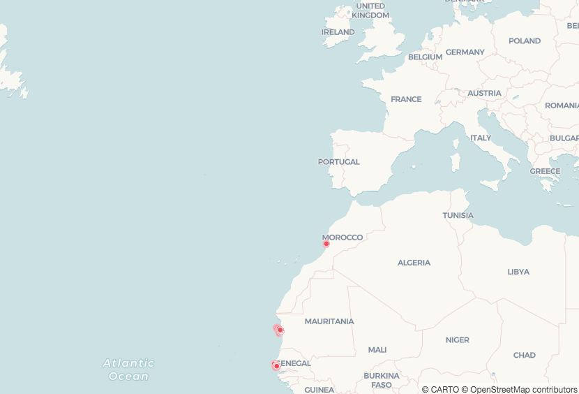
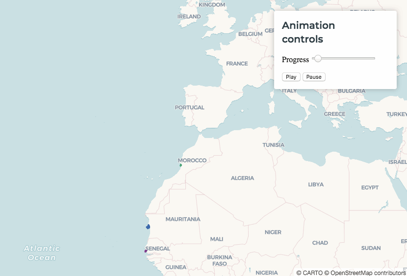

# Animation

*In this section we'll set up a basic animated map of points. We will also add controls so our viewers can play or pause the animation, and set it's duration.*

## <a name="steps8">Steps</a>

 1. [Create a Basic Map](#createTemplate8)
 2. [Animate It](#animateMap)
 3. [Animation Options](#animOptions)
 4. [Improve the Visualisation](#improveVis8)
 5. [Control Your Animation](#controlAnim)
 6. [Advanced Animation](#advancedAnim)

## <a name="createTemplate8">Create a Basic Map</a>

Let's create a new map using bird migration data. We're animating points in this map, but one important feature of CARTO VL is that we can also animate polygons and lines. Paste this into your `index.html` document:

```html
<!DOCTYPE html>
<html>

<head>
  <title>CARTO VL training</title>
  <meta name="viewport" content="width=device-width, initial-scale=1.0">
  <meta charset="UTF-8">
  <!-- Include CARTO VL JS from the CARTO CDN-->
  <script src="https://libs.cartocdn.com/carto-vl/v1.0.0/carto-vl.min.js"></script>
  <!-- Include Mapbox GL from the Mapbox CDN-->
  <script src="https://api.tiles.mapbox.com/mapbox-gl-js/v0.50.0/mapbox-gl.js"></script>
  <link href="https://api.tiles.mapbox.com/mapbox-gl-js/v0.50.0/mapbox-gl.css" rel="stylesheet" />
  <!-- Include CARTO styles-->
  <link href="https://carto.com/developers/carto-vl/examples/maps/style.css" rel="stylesheet">
</head>

<body>
  <div id="map"></div>

  <script>
    const map = new mapboxgl.Map({
      container: 'map',
      style: carto.basemaps.voyager,
      center: [-15, 36],
      zoom: 2.8
    });

    carto.setDefaultAuth({
      user: 'cartovl',
      apiKey: 'default_public'
    });

    const source = new carto.source.Dataset('bird_journey');
    const viz = new carto.Viz();
    const layer = new carto.Layer('layer', source, viz);

    layer.addTo(map);
  </script>
</body>

</html>
```

[Back to Steps List ^](#steps8)

## <a name="animateMap">Animate It</a>

Add this line to your `viz`:

```javascript
const viz = new carto.Viz(`
  filter: animation($date_time)
`);
```

We learned in the last section that [filter](https://carto.com/developers/carto-vl/reference/#cartoexpressions) sets a condition. If your data does not meet that condition, it will not appear in your map.

When we use an [animation expression](https://carto.com/developers/carto-vl/reference/#cartoexpressionsanimation) for filter, CARTO detects the lowest and highest values in the column you're applying the expression to.

* For a timestamp-type column like `date_time`, CARTO will automatically detect the earliest date and latest date.
* If we used a number-type column instead, CARTO will automatically detect the lowest number and highest number.

The animation will progress from the earliest value in `date_time` to the latest value.

How CARTO knows which points to show at which time:

* CARTO calculates the entire range between the lowest and highest values in our column. In this case it's recognizing the entire time span between our earliest date and latest date as one block of time.
* Then CARTO plots that entire range of time across a certain duration. This animation's duration will be 10 seconds. That's the default duration unless you define another.
* CARTO starts the animation and steps through the entire `date_time` range during that 10 seconds. During this progression, when a point's `date_time` timestamp matches the time range step the animation is currently at, that point appears on the map.

For a more detailed explanation see [this guide](https://carto.com/developers/carto-vl/guides/animated-visualizations/#create-a-basic-animation).

*Here's what your map should look like now:*


[Back to Steps List ^](#steps8)

## <a name="animOptions">Animation Options</a>

In the last step we mentioned default duration time. The animation expression allows you two other parameters besides your input column:

* duration
* fade

Duration lets you specify how long the whole animation will last.

Fade lets you specify how long it takes for a point to fade in and fade out.

You can use both parameters to fine-tune your animation. Find out more in [this guide](https://carto.com/developers/carto-vl/guides/animated-visualizations/#style-and-configure-the-animation).

Replace your current filter with this:

```javascript
filter: animation($date_time, 10, fade(0, 0.5))
```

* `10` is the duration time in seconds.
* `0` is the time it takes for a point to fade in. In this case we want the point to appear immediately without fading.
* `0.5` is the time it takes for a point to fade out, in seconds. In this case it will take half a second to become invisible.

*We already had a 10 second duration in the last map, but notice how the fade in and fade out have changed. In the last map we didn't define fade in our out, so they defaulted to 0.15 seconds each.*



[Back to Steps List ^](#steps8)

## <a name="improveVis8">Improve the Visualisation</a>

We can store our animation expression in a variable, and then use the variable as our filter definition. This can be useful later on, if we want to use more than one filter expression.

Let's also use a color expression to visualize birds by category while we animate. Replace your `viz` definition with this:

```javascript
const viz = new carto.Viz(`
  @animation: animation($date_time, 10, fade(0, 0.5))
  filter: @animation
  color: ramp(buckets($bird_name, ["Sanne", "Eric", "Nico"]), bold)
  width: 2
  strokeWidth: 0
`);
```

* The @ symbol defines our variable. You can choose any name you want, just prepend the @ symbol to it.
* Since `bird_name` is a string-type column, [ramp](https://carto.com/developers/carto-vl/reference/#cartoexpressionsramp) is automatically creating a category map by assigning each unique bird name to one of the colors in our [Bold qualitative CARTOColor palette](https://carto.com/carto-colors/).

*Now we can see which points represent each bird's journey:*


Check [this section of our guides](https://carto.com/developers/carto-vl/guides/animated-visualizations/#style-and-configure-the-animation) for more details about the animation expression and it's options.

[Back to Steps List ^](#steps8)

## <a name="controlAnim">Control Your Animation</a>

Let's add animation controls, so our map viewers can play or pause the animation. The control elements and their functionality are also explained [here](https://carto.com/developers/carto-vl/guides/animated-visualizations/#animation-controls). We will use the HTML elements below to create an overlay that contains buttons and a slider. Add this code block underneath `<div id="map"></div>`:

```html
<aside class="toolbox">
  <div class="box">
    <header>
      <h1>Animation controls</h1>
    </header>
    <section>
      <p>Progress <input disabled="disabled" type="range" id="js-progress-range" min="0" max="1" step="0.01"></p>
    </section>
    <section>
      <button id="js-play-button" class="toolbox-button">Play</button>
      <button id="js-pause-button" class="toolbox-button">Pause</button>
    </section>
  </div>
</aside>
```

* The input element with a `js-progress-range` id is our slider.
* You can identify the play and pause buttons by the id names in the button elements.

Now add variables that give our JavaScript code access to this slider and buttons. Paste this under `const layer = new carto.Layer('layer', source, viz);`:

```javascript
const $progressRange = document.getElementById('js-progress-range');
const $playButton = document.getElementById('js-play-button');
const $pauseButton = document.getElementById('js-pause-button');
```

Paste the code below underneath what you added in Step 6. This code detects when the play or pause button is clicked on, then runs a function to either play the animation or pause it.

```javascript
$playButton.addEventListener('click', () => {
  viz.variables.animation.play();
});
$pauseButton.addEventListener('click', () => {
  viz.variables.animation.pause();
});
```

Paste this code underneath what you added in the last step. The `updateProgress` function detects how far the animation has progressed with the `getProgressPct` function, then uses that to update the slider.

This progress check happens every 100 milliseconds, because that's how often we are running the `updateProgress` function according to the `setInterval` function beneath it.

```javascript
function updateProgress() {
  $progressRange.value = viz.variables.animation.getProgressPct();
}
setInterval(updateProgress, 100);
```

*Now our map should look like this:*



[Back to Steps List ^](#steps8)

## <a name="advancedAnim">Advanced Animation</a>

We've been using the `date_time` column's whole time range in this animation. We can use an expression as an input instead, to only animate a part of that time range. Check [this guide section](https://carto.com/developers/carto-vl/guides/animated-visualizations/#taking-it-further) for more details.

Replace your current `@animation` variable with this:

```javascript
@animation: animation(linear($date_time, time('2014-03-30T20:24:25Z'), time('2014-04-24T23:52:14Z')), 10)
```

Now we will only visualize where the birds were from March 30th to April 24th, 2014. We can also take our whole animation expression and assign it to a sequential [CartoCOLOR palette](https://carto.com/carto-colors/). Use this expression for your color property:

```javascript
color: ramp(@animation, Oryel)
```

The `Oryel` palette swatches progress from light yellow to orange-red.

*Check out how the bird locations are mapped to those colors over time in our final animation:*


[Back to Steps List ^](#steps8)