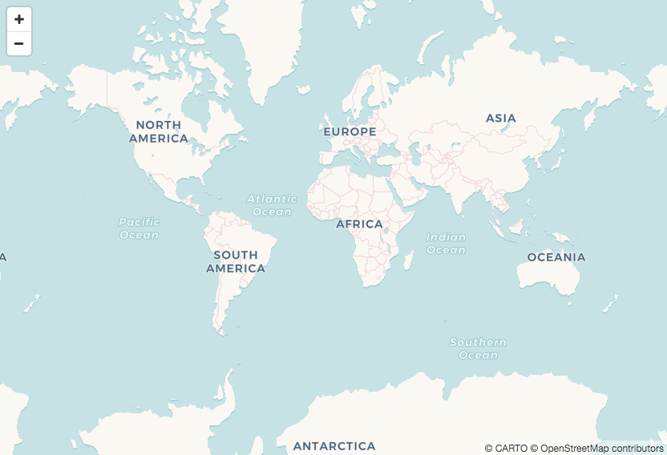
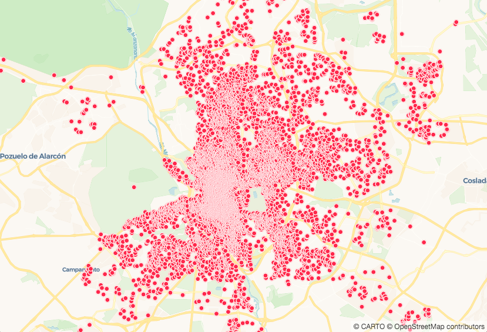
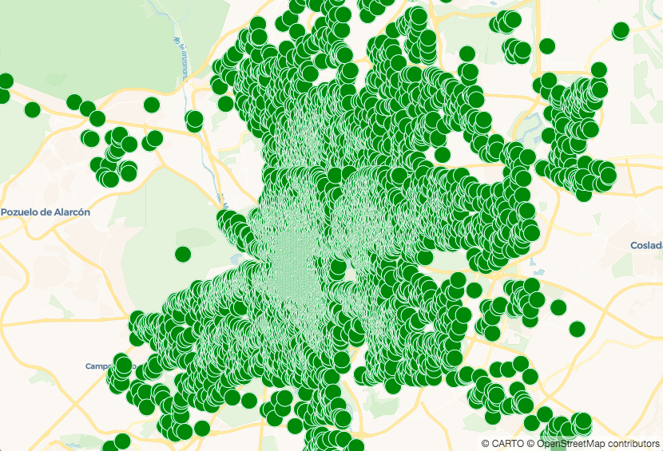

### Prerequisites:
* A computer with a code editor
  * Notepad (Windows default)
  * TextEdit (Mac default)
  * [Sublime Text](https://www.sublimetext.com/)
  * [Atom](https://atom.io/)
___

## Getting Started
*Take the next steps to set up a basic CARTO VL map & view it in your browser.*
*For more help check out our Developer Center's Getting Started documentation [here](https://carto.com/developers/carto-vl/guides/getting-started/).*

### Create a Basic Map
1. Open a new document in your code editor, then paste this into it:

    ```html
    <!DOCTYPE html>
    <html>

    <head>
      <title>CARTO VL training</title>
      <meta name="viewport" content="width=device-width, initial-scale=1.0">
      <meta charset="UTF-8">
      <!-- Mapbox GL -->
      <link href="https://api.tiles.mapbox.com/mapbox-gl-js/v0.50.0-beta.1/mapbox-gl.css" rel="stylesheet" />
      <script src="https://api.tiles.mapbox.com/mapbox-gl-js/v0.50.0-beta.1/mapbox-gl.js"></script>
      <!-- CARTO VL JS -->
      <script src="https://libs.cartocdn.com/carto-vl/v0.9.1/carto-vl.min.js"></script>
      <style>
        body {
          margin: 0;
          padding: 0;
        }

        #map {
          position: absolute;
          width: 100%;
          height: 100%;
        }
      </style>
    </head>

    <body>
      <div id="map"></div>

      <script>
        const map = new mapboxgl.Map({
          container: 'map',
          style: carto.basemaps.voyager,
          center: [-3.6908, 40.4297],
          zoom: 11
        });
      </script>
    </body>

    </html>
    ```
  
    **WHY MAPBOX GL?**
    * Notice we are including Mapbox GL JavaScript and style libraries. 
    * CARTO VL uses [Mapbox GL](https://www.mapbox.com/mapbox-gl-js/api/) to render basemaps. 
    * We will use CARTO VL code to add CARTO data layers over the basemap, but because the Mapbox GL libraries are included you also have the option to add native Mapbox data layers to your map.
    * CARTO VL expressions cannot be used for native Mapbox GL layers and vice versa.
    
    **THE MAP OBJECT**
    * `const map = new mapboxgl.Map` gives us a map object. This will contain our visualization.
    * `container: 'map',` puts our map object in this HTML element: `<div id="map"></div>`. 
      * The HTML element acts as a container.
      * We want the map to fill the whole web page in our browser. To do that we define styles for the map's container, inside the `<style>` element.
    * `style: carto.basemaps.voyager` defines which basemap to use. You also have two other basemaps to choose from:
      * `carto.basemaps.positron`
      * `carto.basemaps.darkmatter`
    * `center: [-3.6908, 40.4297]` will center your map on these coordinates.
    * `zoom: 11` displays the map at this default zoom level when it loads.
    
2. Save this file as `index.html` on your computer.
3. Open index.html in your web browser.
    
    *Now you should see this:*
   
    
    
### Add Credentials
*To add other layers on top of the basemap we need access to CARTO datasets. In this example we will use [public](https://carto.com/help/building-maps/privacy-settings-for-protecting-maps-and-data/) data from a CARTO account.*

*Because data privacy is important at CARTO, authentication is required. We use api keys for that. Find out more about how CARTO authentication works [here](https://carto.com/developers/fundamentals/authorization/).*

4. Add this code block beneath `map.addControl(nav, 'top-left');`

    ```html
    carto.setDefaultAuth({
      username: 'cartovl',
      apiKey: 'default_public'
    });
    ```
    
    * `username` is the name of the CARTO account that contains our data.
    * The `default_public` key gives a CARTO VL app access to all of an account's public datasets.
    * You can add a code block like this to your app more than once, so you can pull data from more than one CARTO account into the same map.

### Pull in Data and Style it

*Now that we have access to a CARTO account we can use it's data in this map by defining a `source`. CARTO VL provides a few ways to bring data into your map that we will demonstrate in the next section. One of those methods gets an entire dataset by name:*

5. Add this line beneath the `setDefaultAuth` block:

    `const source = new carto.source.Dataset('madrid_listings');`

    * You can add more than once source to a map.
      * Make sure to give each source `const` a unique name

*This data won't show up on the map until we tell the browser how to render it. We do that by defining style properties inside a [Viz object](https://carto.com/developers/carto-vl/reference/#cartoviz).*

*When the `Viz object` is empty like this, our system will apply default styles:*

6. Add this line beneath the source:

    `const viz = new carto.Viz();`

    * If you are using multiple sources, you need to create a separate Viz object for each one.
      * Make sure the Viz object `const` are named uniquely.

### Add the Data Layer to Your Map

*Now we can create a new map layer using the data source and style definitions:*

7. Add this beneath the viz definition:

    `const layer = new carto.Layer('layer', source, viz);`

    * There can only be one source and Viz object per layer, but you can create more than one layer. Just define a new carto.Layer `const` for each and make sure they are named uniquely.
    * The first function parameter defines a layer's name. You can use whatever name you'd like, here we're using `'layer'`
    * The second parameter is always the name of the source `const` you defined previously, and the third parameter is always the name of the Viz object `const`.

8. Add the layer to the map object:

    `layer.addTo(map);`

    * Notice we're using the mapboxgl.Map object's `const` name, not the containing div element's `"map"` id.

    *When you save these changes in your code editor and refresh your browser, the map should look like this:*

    

9. Let's change the default style by adding our own style rules. 

    CARTO VL offers powerful data-driven styling with expressions, which we will cover later. For now we can make simple marker size and color changes by adding properties to the Viz object:

    ```
    const viz = new carto.Viz(`
      color: green
      width: 20
    `);
    ```

    * In CARTO.js or Builder maps styles are defined differently, because they require CartoCSS. For example, to change a point's color you would use:

      `marker-fill: "green";`

      To change a polygon's color with CartoCSS you would use:

      `polygon-fill: "green";`

      Notice that we don't need to use geometry-specific properties in CARTO VL.
    * CARTO uses two types of Visualization API's to define our Viz properties: String and JavaScript. Learn more about those [here](https://carto.com/developers/carto-vl/guides/style-with-expressions/#the-string-and-javascript-visualization-apis).
      * The back-ticks we're using inside the Viz function indicate we're using the String Visualization API in this map.

    *Now when you save the latest changes and refresh, the map should look like this:*

    
