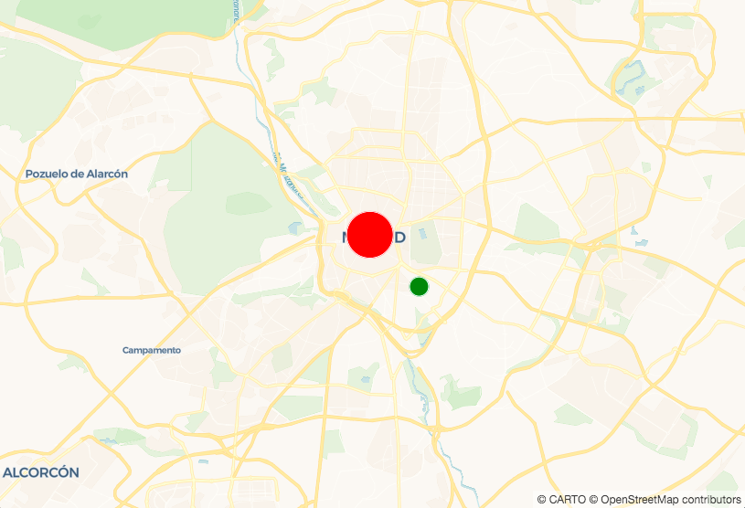

## Using data in your visualization with Sources

*Sources are the basis for your map. They provide the data that you will visualize. In this section we'll demonstrate a few different ways to use them.*

*For more information check our [Add Data Sources guide](https://carto.com/developers/carto-vl/guides/add-data-sources/).*

1. Let's start with the map we made in the Getting Started section. Open it in your code editor.

    ```
    <!DOCTYPE html>
    <html>

    <head>
      <title>CARTO VL training</title>
      <meta name="viewport" content="width=device-width, initial-scale=1.0">
      <meta charset="UTF-8">
      <!-- Mapbox GL -->
      <link href="https://api.tiles.mapbox.com/mapbox-gl-js/v0.50.0-beta.1/mapbox-gl.css" rel="stylesheet" />
      <script src="https://api.tiles.mapbox.com/mapbox-gl-js/v0.50.0-beta.1/mapbox-gl.js"></script>
      <!-- CARTO VL JS -->
      <script src="https://libs.cartocdn.com/carto-vl/v0.9.1/carto-vl.min.js"></script>
      <style>
        body {
            margin: 0;
            padding: 0;
        }

        #map {
          position: absolute;
          width: 100%;
          height: 100%;
         }
      </style>
    </head>

    <body>
      <div id="map"></div>

      <script>
        const map = new mapboxgl.Map({
          container: 'map',
          style: carto.basemaps.voyager,
          center: [-3.6908, 40.4297],
          zoom: 11
        });

        carto.setDefaultAuth({
          username: 'cartovl',
          apiKey: 'default_public'
        });

        const source = new carto.source.Dataset('madrid_listings');

        const viz = new carto.Viz(`
          color: green
          width: 20
        `);
        
        const layer = new carto.Layer('layer', source, viz);

        layer.addTo(map);
      </script>
    </body>

    </html>
    ```

### Dataset Source with Custom Credentials
2. One powerful feature of CARTO VL is that you can use data from a few different sources in the same map. 

    Replace the existing `source` with a dataset from a different CARTO account:

    ```
    const citiesSource = new carto.source.Dataset('populated_places', {
      username: 'documentation',
      apiKey: 'default_public'
    });
    ``` 

    * Notice we're still using the Dataset source, but this time we're using an optional second parameter. 
      * We have already defined default authorization in the `setDefaultAuth` function, but this second parameter authorizes this map to use the `populated_places` dataset from a different CARTO account.
      * The Dataset source actually accepts three parameters, find out more [here](https://carto.com/developers/carto-vl/reference/#cartosourcedataset).

3. Make sure to update the layer definition with the new source name:

    `const layer = new carto.Layer('layer', citiesSource, viz);`

### Add a GeoJSON Source and Layer

4. CARTO VL also provides other ways to pull in source data.

    For example you can use a [SQL source](https://carto.com/developers/carto-vl/reference/#cartosourcesql) like this:

    ```
    const citiesSource = new carto.source.SQL('SELECT * FROM populated_places WHERE pop_max > 10000000', {
      username: 'documentation',
      apiKey: 'default_public'
    });
    ```

    This is useful if:
    * you only want to use part of a dataset.
    * you want to manipulate the original data with [PostgreSQL](https://carto.com/help/working-with-data/easy-sql/) or [PostGIS](https://carto.com/help/diy/postgis/) and use the results in your map.

    Our `citiesSource` query is letting us use only large cities from the `populated_places` dataset. That's happening because our query contains a WHERE clause that will only select cities with a maximum population of more than ten million people.

    See which kinds of sources you can use and example code [here](https://carto.com/developers/carto-vl/reference/#cartosource) in our documentation.

    In this map let's add a second layer that uses a GeoJSON source. We want this layer to show CARTO's Madrid office location. Add this to your code:

    ```
    const office = {
      "type": "FeatureCollection",
      "features": [
        {
          "type": "Feature",
          "geometry": {
            "type": "Point",
            "coordinates": [-3.70379, 40.416775]
          },
          "properties": {
            "address": "Madrid, Spain"
          }
        }
      ]
    };
    ``` 

    We've put the GeoJSON into a `const` variable. Now we can use it as a source when we add code like this:

    `const officeSource = new carto.source.GeoJSON(office);`

5. Now add styles for the GeoJSON source and create a layer with them. Add the layer to your map object.

    ```
    const officeViz = new carto.Viz(`
      color: red
      width: 50
    `);

    const officeLayer = new carto.Layer('office', officeSource, officeViz);

    officeLayer.addTo(map);
    ```

    *When you save these changes and open your code document in a browser, your map should show a red point for the city of Madrid, and a green point for the CARTO office, like this:*

    

