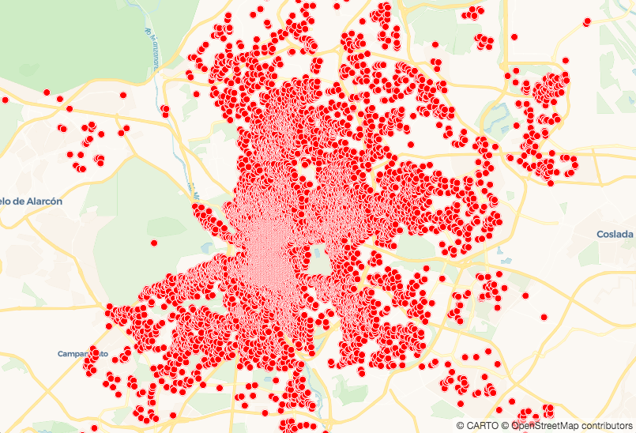
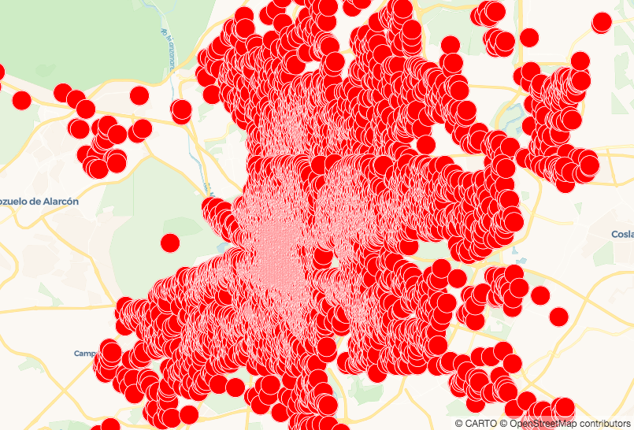

## Styling Properties Using Expressions

*Every feature in your map's data layer has properties like width and/or color. [Check out all of the properties available](https://carto.com/developers/carto-vl/reference/#cartoexpressions).

How you choose to style these has a big effect on how legible your map is. CARTO VL offers great flexibility for defining your styles, because it allows you to use expressions.*

Expressions can be static values, like `red`. 

Expressions can also be functions. Functions take an input, use it in some kind of calculation or transformation, and output another value. This value is used to define your style. Some of these are math functions that you might have heard of before, like `sqrt()`.

CARTO VL expressions can be other types of functions though, including ones that work with color values.

You can also combine expressions using *expression functions*.
* An expression example = `sqrt(9)`
* An expression function example = `sqrt(9) + cos(10)`

Check [this guide](https://carto.com/developers/carto-vl/guides/style-with-expressions/#what-is-an-expression) for a more detailed explanation of expressions. You can find a list of CARTO VL expressions and expression functions [here](https://carto.com/developers/carto-vl/reference/#cartoexpressions).

In this section we're going to demonstrate a few kinds of expressions.*

1. Let's create a new map. Replace all of the code in your index.html file with this:

    ```
    <!DOCTYPE html>
    <html>

    <head>
      <title>CARTO VL training</title>
      <meta name="viewport" content="width=device-width, initial-scale=1.0">
      <meta charset="UTF-8">
      <!-- Mapbox GL -->
      <link href="https://api.tiles.mapbox.com/mapbox-gl-js/v0.50.0-beta.1/mapbox-gl.css" rel="stylesheet" />
      <script src="https://api.tiles.mapbox.com/mapbox-gl-js/v0.50.0-beta.1/mapbox-gl.js"></script>
      <!-- CARTO VL JS -->
      <script src="https://libs.cartocdn.com/carto-vl/v0.9.1/carto-vl.min.js"></script>
      <style>
        body {
          margin: 0;
          padding: 0;
        }

        #map {
          position: absolute;
          width: 100%;
          height: 100%;
        }
      </style>
    </head>

    <body>
      <div id="map"></div>

      <script>
        const map = new mapboxgl.Map({
          container: 'map',
          style: carto.basemaps.voyager,
          center: [-3.6908, 40.4297],
          zoom: 11
        });

        carto.setDefaultAuth({
          user: 'cartovl',
          apiKey: 'default_public'
        });

        const source = new carto.source.Dataset('madrid_listings');
        const viz = new carto.Viz(`
          width: 8
          color: red
        `);
        const layer = new carto.Layer('layer', source, viz);

        layer.addTo(map);
      </script>
    </body>

    </html>
    ```

When you open this in a browser, your map should look like this:




### Define Width with an Expression Function

Take a look at how width is defined in the `viz` object. It's telling our system to draw point markers that are 8 pixels wide.

We can use an expression function here instead.

2. Replace the current width property with this:

`width: 8 + 16`

Now when you save and refresh the map, the points should be 24 pixels wide:



CARTO VL has a lot of ways to define color using different expressions. They even let you use a few different [color spaces](https://photo.stackexchange.com/questions/48984/what-is-the-difference-or-relation-between-a-color-model-and-a-color-space), like [CIELab](https://carto.com/developers/carto-vl/reference/#cartoexpressionspalettes), [HSL]() and [RGB]()
