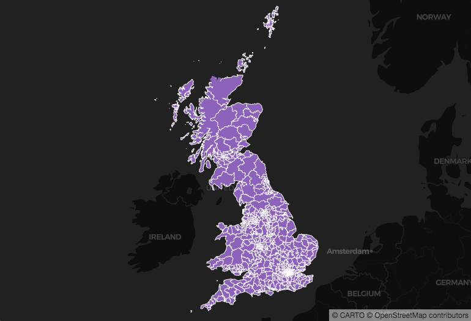
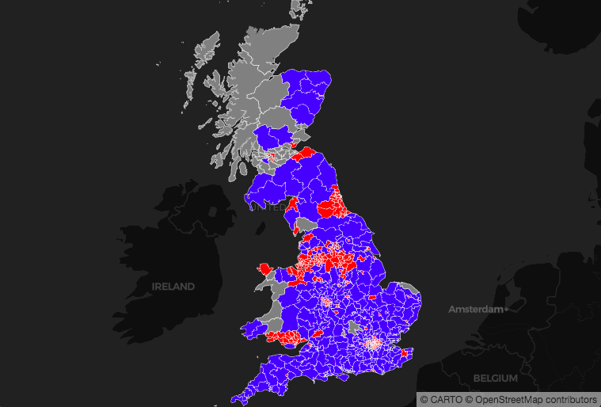
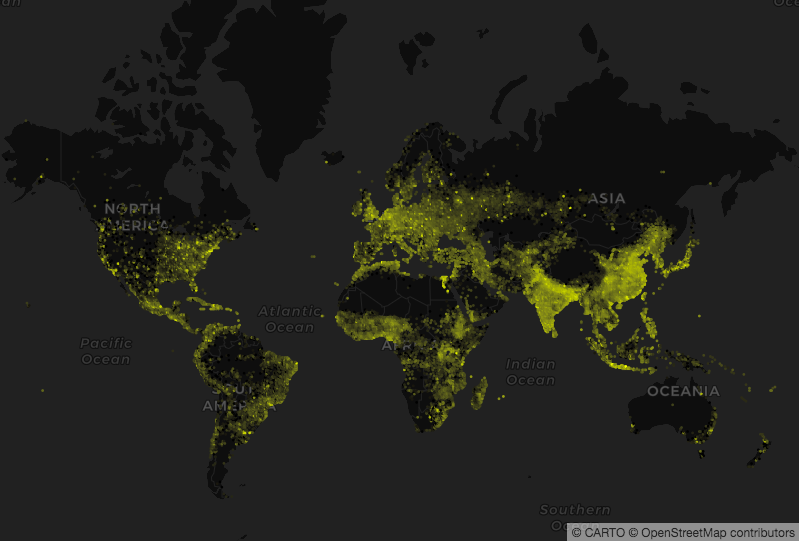
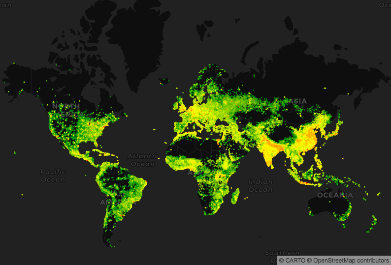

## Introduction to Ramps and Data-Driven Visualizations

The main goal when styling your map is to illustrate an insight from your data. You can do that by changing a feature's properties according to the data it represents. For example, you can change a feature's color or size according to one (or more) data attributes.

CARTO VL offers functions that do the work of styling features according to attribute behind-the-scenes. In this section we'll demonstrate how, but for more detailed information see our Data Driven Styling guides [Part 1](https://carto.com/developers/carto-vl/guides/data-driven-visualizations-part-1/) and [Part 2](https://carto.com/developers/carto-vl/guides/data-driven-visualizations-part-2/).

### Create a Basic Map
1. For this section let's start with a map of UK elections. Leave the `viz` object empty for this step:

    ```
    <!DOCTYPE html>
    <html>

    <head>
        <title>CARTO VL training</title>
        <meta name="viewport" content="width=device-width, initial-scale=1.0">
        <meta charset="UTF-8">
        <!-- Mapbox GL -->
        <link href="https://api.tiles.mapbox.com/mapbox-gl-js/v0.50.0-beta.1/mapbox-gl.css" rel="stylesheet" />
        <script src="https://api.tiles.mapbox.com/mapbox-gl-js/v0.50.0-beta.1/mapbox-gl.js"></script>
        <!-- CARTO VL JS -->
        <script src="https://libs.cartocdn.com/carto-vl/v0.9.1/carto-vl.min.js"></script>
        <style>
            body {
                margin: 0;
                padding: 0;
            }

            #map {
                position: absolute;
                width: 100%;
                height: 100%;
            }
        </style>
    </head>

    <body>
        <div id="map"></div>

        <script>
            const map = new mapboxgl.Map({
                container: 'map',
                style: carto.basemaps.darkmatter,
                center: [-3, 54.8],
                zoom: 4.5
            });

            carto.setDefaultAuth({
                user: 'cartovl',
                apiKey: 'default_public'
            });

            const source = new carto.source.Dataset('uk_elections');
            const viz = new carto.Viz();
            const layer = new carto.Layer('layer', source, viz);

            layer.addTo(map);
        </script>
    </body>

    </html>
    ```

    Now your map should show UK polygons in default CARTO styles:

    

This is election data, and we'd like to show which party won the election in each area. 
  * Our dataset contains a string-type column named `winner`. 
  * For each polygon, the `winner` column lists the name of the political party that won there.

Since we know the names of the parties in that column, we can use them as categories. To show our map viewers who won, we can make a *classed* map: define a bucket (or bin) for each category and then classify each polygon according to the bucket it belongs to.

CARTO VL offers [a ramp() function](https://carto.com/developers/carto-vl/reference/#cartoexpressionsramp) that will assign colors to categories for us. We just need to define the categories and colors first, using the [buckets() function](https://carto.com/developers/carto-vl/reference/#cartoexpressionsbuckets). Then we can use both functions inside an expression to define our map layer's color property.

2. Add a color and strokeColor to your `viz`:

    ```
    const viz = new carto.Viz(`
      color: ramp(buckets($winner, ["Conservative Party", "Labour Party"]), [blue, red])
      strokeColor: opacity(white, 0.6)
    `);
    ```

    * The first parameter in the buckets function is the column name, which needs to be prepended with a $.
    * The second buckets parameter is an array of category names. Since we're working with text values they need to be enclosed in quotes.
    * The ramp function takes the whole buckets function as it's first parameter. 
    * The second ramp parameter is an array of colors. Their order corresponds with the order of our bucket categories, so `Conservative Party` polygons will be blue.
      * We don't need quotes around [named colors](https://htmlcolorcodes.com/color-names/). 

    Now our map should look like this:

    

### Ramp and Numeric Properties

What happens if you want to color your features by category, but you have a large dataset and don't immediately know all of the different categories it's column contains?

Ramp can find the categories for you. 

In this case we have numeric data: a column named `dn` that contains a population density value for each of it's point locations. 

Notice how we don't need to specify buckets below. When we don't specify buckets, we're creating an *unclassed map*. Each point is colored according to how much of an attribute it contains, instead being put into a discrete category and given that category's assigned color.

3. Change your map object's settings:


4. Replace your `source` and `viz` with this:

    ```
    const source = new carto.source.Dataset('pop_density_points');

    const viz = new carto.Viz(`
      width: 2
      color: ramp($dn, [black, yellow])
      strokeWidth: 0
    `);
    ```

    

    * The points with lowest population density are colored black, and the points with highest population density are colored yellow.
    * But since this is an unclassed map, most points have values that fall between the lowest number and highest number. They are assigned a color that falls on a gradient between black and yellow. That's why we see gray points, and dark yellow points. 

### Improve the Style

Our points with low population density are hard to see, since they are about the same color as the basemap. We can make them more legible by changing our color ramp's first value. 

We can also make it easier to see the places with mid-range population density by defining a third color in our ramp (you can define as many colors as you'd like).

5. Replace the color property in your `viz` with this:

    `color: ramp($dn, [green, yellow, red])`

    Notice the difference:

    


### Classify a Numeric Property for Better Perception

    ```
    const viz = new carto.Viz(`
      width: 1.5
      color: ramp(globalQuantiles($dn, 3), [green, yellow, red])
      strokeWidth: 0
    `);
    ```

### The `Others` Category

    ```
    const source = new carto.source.Dataset('uk_elections');
    
    const viz = new carto.Viz(`
      color: ramp(buckets($winner, ["Conservative Party", "Labour Party"]), [blue, red], white)
      strokeColor: opacity(white, 0.6)
    `);
    ```

### Find the Most Common Categories

    ```
    const source = new carto.source.Dataset('dot_rail_safety_data');
    
    const viz = new carto.Viz(`
      width: 10
      strokeWidth: 0.2
      color: ramp(top($accident_type, 3), [#3969AC, #F2B701, #E73F74], #A5AA99)
    `);
    ```

### Showing All Categories for Exploratory Analysis

    ```
    const viz = new carto.Viz(`
      width: 10
      strokeWidth: 0.2
      color: ramp($accident_type, [#7F3C8D,
      #11A579,
      #3969AC,
      #F2B701,
      #E73F74,
      #80BA5A])
    `);
    ```

### CARTOColors

    ```
    const source = new carto.source.Dataset('pop_density_points');
    
    const viz = new carto.Viz(`
      width: 2
      color: ramp($dn, temps)
      strokeWidth: 0
    `);
    ```

### Create a Bubble Map

    ```
    const source = new carto.source.Dataset('dot_rail_safety_data');
    
    const viz = new carto.Viz(`
      width: ramp($total_damage, [0, 50])
      strokeWidth: 0.2
      color: ramp(top($accident_type, 3), [#3969AC, #F2B701, #E73F74], #A5AA99)
    `);
    ```

### Size Perception

    ```
    const viz = new carto.Viz(`
      width: sqrt(ramp($total_damage, [0, 50^2]))
      strokeWidth: 0.2
      color: ramp(top($accident_type, 3), [#3969AC, #F2B701, #E73F74], #A5AA99)
    `);
    ```

### Introducing Symbols and Images

    ```
    const viz = new carto.Viz(`
      width: sqrt(ramp($total_damage, [0, 50^2]))
      strokeWidth: 0.2
      color: ramp(top($accident_type, 3), [#3969AC, #F2B701, #E73F74], #A5AA99)
      symbol: ramp(top($accident_type, 3), [star, triangle, square])
    `);
    ```