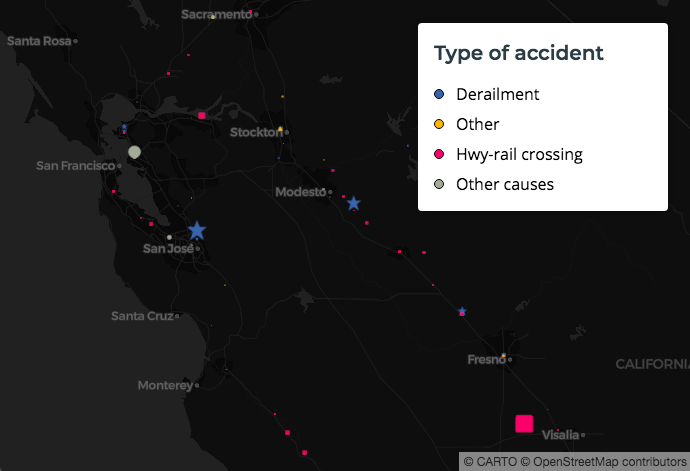
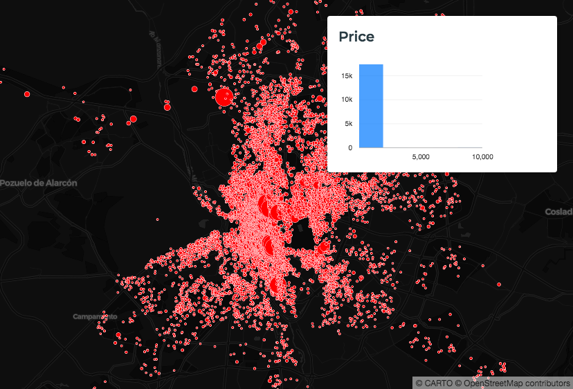
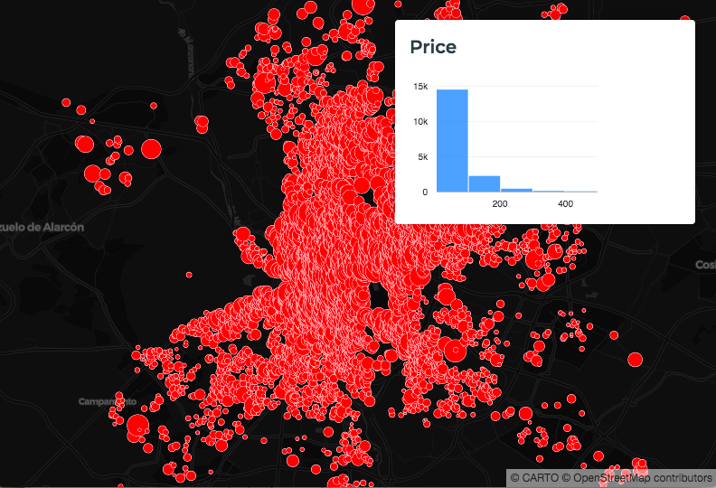
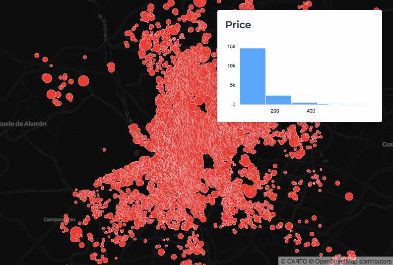

## Using Legends

There's one thing missing from our maps so far: Legends. Every good map should use a legend that explains it's features at a glance.

### Create a Basic Map
1. Let's continue with our map from the last section:

    ```
    <!DOCTYPE html>
    <html>

    <head>
        <title>CARTO VL training</title>
        <meta name="viewport" content="width=device-width, initial-scale=1.0">
        <meta charset="UTF-8">
        <!-- Mapbox GL -->
        <link href="https://api.tiles.mapbox.com/mapbox-gl-js/v0.50.0-beta.1/mapbox-gl.css" rel="stylesheet" />
        <script src="https://api.tiles.mapbox.com/mapbox-gl-js/v0.50.0-beta.1/mapbox-gl.js"></script>
        <!-- CARTO VL JS -->
        <script src="https://libs.cartocdn.com/carto-vl/v0.9.1/carto-vl.min.js"></script>
        <style>
            body {
                margin: 0;
                padding: 0;
            }

            #map {
                position: absolute;
                width: 100%;
                height: 100%;
            }
        </style>
    </head>

    <body>
        <div id="map"></div>

        <script>
            const map = new mapboxgl.Map({
              container: 'map',
              style: carto.basemaps.darkmatter,
              center: [-96, 41],
              zoom: 3
            });

            carto.setDefaultAuth({
                user: 'cartovl',
                apiKey: 'default_public'
            });

            const source = new carto.source.Dataset('dot_rail_safety_data');
            const viz = new carto.Viz(`
              width: sqrt(ramp($total_damage, [0, 50^2]))
              strokeWidth: 0.2
              color: ramp(top($accident_type, 3), [#3969AC, #F2B701, #E73F74], #A5AA99)
              symbol: ramp(top($accident_type, 3), [star, triangle, square])
            `);
            const layer = new carto.Layer('layer', source, viz);

            layer.addTo(map);
        </script>
    </body>

    </html>
    ```

    

### Add a Legend

2. Add an HTML element that will contain our Legend, by pasting this into your code under `<div id="map"></div>`:

    ```
    <aside class="toolbox">
        <div class="box">
            <header>
                <h1>Type of accident</h1>
            </header>
            <section>
                <div id="controls">
                    <ul id="content"></ul>
                </div>
            </section>
            <footer class="js-footer"></footer>
        </div>
    </aside>
    ```

    When you save this and open your HTML file in a browser, it should look like this:

    

    Notice there's not much content related to the actual map features yet. At this point we're just setting up a container.
    * [`aside`](https://developer.mozilla.org/en-US/docs/Web/HTML/Element/aside) is an HTML element used as a container for content that's considered separate from the page's main content.
    * We're also using a CARTO-specific `box` class to define styles for the Legend container...basically making it a white box with round edges.
    * The [`header` element](https://developer.mozilla.org/en-US/docs/Web/HTML/Element/header) is where we're storing our Legend title. 
      * We're using default [`h1`](https://developer.mozilla.org/en-US/docs/Web/HTML/Element/Heading_Elements) tags to define the font style for our title.
      * You can modify this to use other [section heading elements](https://developer.mozilla.org/en-US/docs/Web/HTML/Element/Heading_Elements) or text styles as needed.
    * [`section`](https://developer.mozilla.org/en-US/docs/Web/HTML/Element/section) is an HTML element that's used to group content. 
    * Find out more about the footer element [here](https://developer.mozilla.org/en-US/docs/Web/HTML/Element/footer).

One of the great things about CARTO VL is that it provides a function to auto-detect our map layer's data and styles: [`getLegendData()`](https://carto.com/developers/carto-vl/reference/#expressionsrampgetlegenddata). We can use that to create our Legend elements.

3. Paste this under `layer.addTo(map);`:

    ```
    layer.on('loaded', () => {
      const colorLegend = layer.viz.color.getLegendData();
      let colorLegendList = '';
      function rgbToHex(color) {
        return "#" + ((1 << 24) + (color.r << 16) + (color.g << 8) + color.b).toString(16).slice(1);
      }
      colorLegend.data.forEach((legend, index) => {
        const color = legend.value
              ? rgbToHex(legend.value)
              : 'white'
            if (color) {
              colorLegendList +=
                `<li><span class="point-mark" style="background-color:${color}; border: 1px solid black;"></span><span>${legend.key.replace('CARTO_VL_OTHERS', 'Other causes')}</span></li>\n`;
              }
      });
      document.getElementById('content').innerHTML = colorLegendList;
    });
    ```

    Now our legend contains icons representing our map features, and a label to let our viewers identify what they represent.

    

    * After the map layer's feature colors are retrieved using `getLegendData`, `rgbToHex()` converts them to [hexadecimal notation](https://developer.mozilla.org/en-US/docs/Web/HTML/Applying_color#RGB_values).
    * The next function creates a Legend item containing a color icon and a label. It uses the information retrieved by `getLegendData` to generate the proper color and label for each type of map feature.

### Add a Histogram using Airship

Another way to explain your visualization is to use a Widget. Legends explain the attributes you're already highlighting via feature styles, but 
Widgets can show additional attributes.

For example, we previously created a Madrid Listings rental real estate map that styled points according to room price. We can add a Histogram Widget to show more information about the prices overall. You'll be able to use the Widget to filter the map view's listings by price.

CARTO's [Airship](https://carto.com/developers/airship/) library already provides an interface component we can customize for this Widget.

4. Replace all of the code between the body `<script></script>' elements with this to create our election map.

    ```
    const map = new mapboxgl.Map({
      container: 'map',
      style: carto.basemaps.darkmatter,
      center: [-3.6908, 40.4297],
      zoom: 11
    });

    carto.setDefaultAuth({
      user: 'cartovl',
      apiKey: 'default_public'
    });

    const source = new carto.source.Dataset('madrid_listings');
    const viz = new carto.Viz(`
      width: sqrt(ramp($price, [4, 25^2]))
      strokeWidth: 0.5
      color: red
      filter: $price < 500
    `);
    const layer = new carto.Layer('layer', source, viz);

    layer.addTo(map);
    ```

5. Add this to your `viz` above the `width` property:

    `@histogram: viewportHistogram($price, 1, 5)`

    * [viewportHistogram](https://carto.com/developers/carto-vl/reference/) means we are only using the data that is inside the map view bounds.
    * `$price` is the attribute we are illustrating in this histogram. It is a number-type column in our dataset.
      * `viewportHistogram` can also take an expression as it's first parameter.
    * `1` is the "size" of our histogram. It defines the number of histogram bars.
      * This is an optional parameter. If you don't use it, the histogram will divide the price data into 20 bars by default.
    * `5` means this histogram function is going to weight each occurrence differently based on the number 5.
      * This is also an optional parameter. It's default is `1`, which is an unweighted count.

    This line defines our histogram, but we still have to draw it.

6. Paste this into your code underneath `layer.addTo(map);`:

    ```
    function drawHistogram() {
      var histogramWidget = document.querySelector('as-histogram-Widget');
      const histogram = layer.viz.variables.histogram.value;
      histogramWidget.data = histogram.map(entry => {
        return {
          start: entry.x[0],
          end: entry.x[1],
          value: entry.y
        }
      });
    }
    ```

    * The `var histogramWidget` line creates an Airship histogram Widget.
    * The `const histogram` line reads values from the `viewportHistogram` function in our `viz`.
    * The `histogramWidget.data` line maps the values to our histogram. 

    For more details about how Airship Histogram Widget Components work, see [this documentation](https://carto.com/developers/airship/reference/#/components/histogram-Widget).

    Now we just need to call the drawHistogram function to draw the histogram on our map. 

7. Paste this line into your code under `layer.addTo(map);`:

    `layer.on('loaded', drawHistogram);`

    Now when our map layer loads the histogram will automatically be rendered.

    

### Filter Outliers for a Better Histogram

There's quite a lot of data in our Madrid Listings $price column. What if we're only interested in the smaller listings? We can visualize smaller values only using a CARTO VL [filter](https://carto.com/developers/carto-vl/reference/) expression.

8. Add a `filter` line to your `viz` like this:

    ```
    const viz = new carto.Viz(`
      @histogram: viewportHistogram($price, 1, 5)
      width: sqrt(ramp($price, [4, 25^2]))
      strokeWidth: 0.5
      color: red
      filter: $price < 500
    `);
    ```

    Notice when you refresh the map that the Histogram Widget refreshes also. Now we're only looking at values less than 500:

    

### Update Histogram on Viewport Changes

Right now if you zoom in or out on the map, the Histogram Widget won't change even though we're supposed to be taking into account only the data inside the viewport. 

The reason the Widget isn't changing is because it's not aware that the amount of data in the viewport is changing when we zoom. We can detect the change though and then update the Widget with another line of code.

9. Paste this into your code, underneath the `layer.on('loaded', drawHistogram);` line:

    `layer.on('updated', drawHistogram);`

    * Now when an update is detected in our layer we're re-running the function that draws our histogram. It will automatically re-draw using only the data in the viewport at that time.

    

### Create an Airship Category Widget using a Histogram

Another useful Widget Airship offers is a Category Widget. This will let us work with string-type values. For example, what if you wanted to see how many of these listing are for Private rooms?

We can get the room type data in histogram format, but instead of displaying it as a bar chart we can display the bars by category. 

10. Change your `viz` histogram line to this:

    `@histogram: viewportHistogram($room_type, 1, 5)`

    * Now we are getting information from a different column named `room_type`. This is a string-type column.

11. Replace your current `drawHistogram` function with this:

    ```
    function drawHistogram() {
      var categoryWidget = document.querySelector('as-category-widget');
      const histogram = layer.viz.variables.histogram.value;
      var categoryWidget = document.querySelector('as-category-widget');
      categoryWidget.categories = histogram.map(entry => {
        return {
          name: entry.x,
          value: entry.y
        }
      });
    }
    ```

    * The Category Widget is [another kind of Airship Component](https://carto.com/developers/airship/reference/#/components/category-widget).
    * We are still taking the data from our `viz` `viewportHistogram` function, but now it's working with strings instead of numbers.

    Now when you save & refresh your map we can see that the most common rentals are for entire homes or apartments. There are about 10,700 of those.

    


