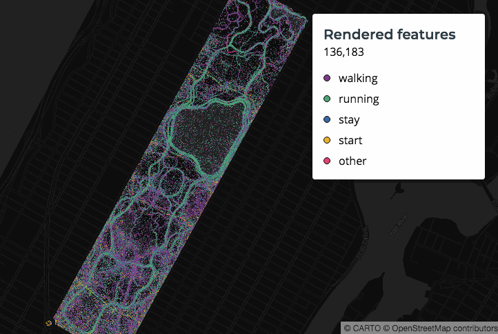
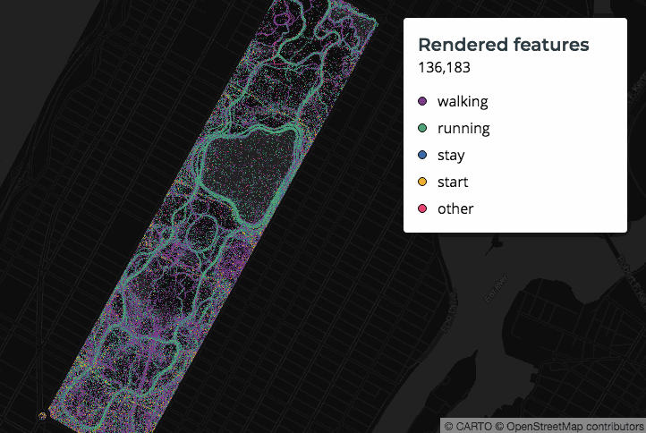
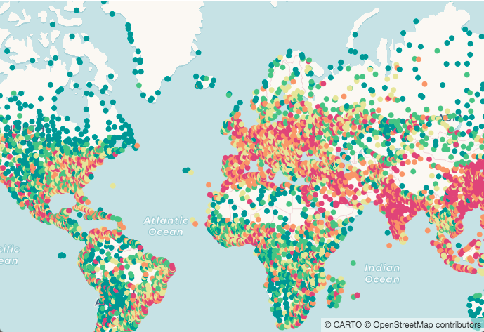
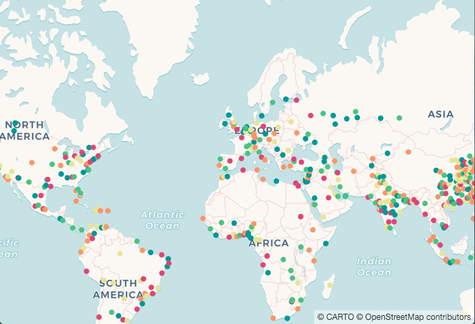
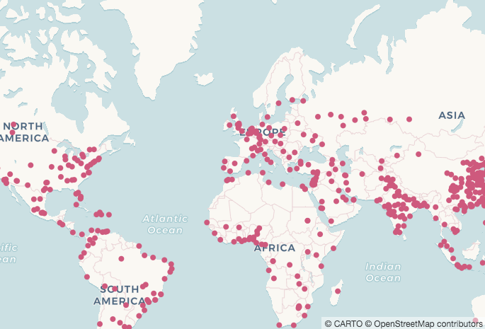
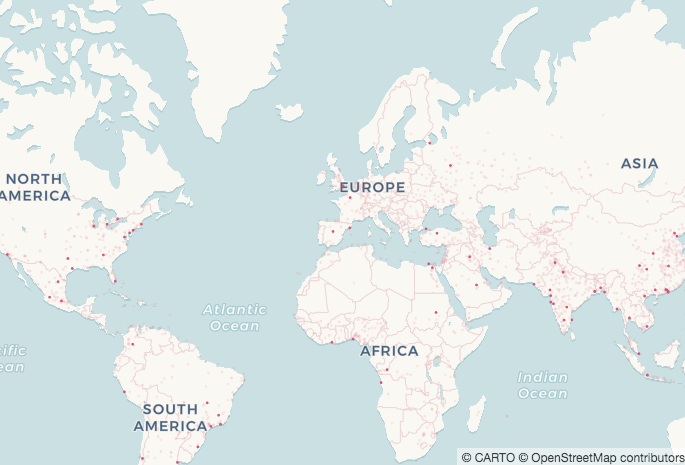

## Zoom-Based Styles

In the last section we sized points proportionally according to total velocity / number of points being aggregated. This looks fine at our default zoom level, but look what happens when we zoom in:



We can make the points much easier to see at different zoom levels when we use CARTO VL's [scaled](https://carto.com/developers/carto-vl/reference/#cartoexpressionsscaled) expression. Learn more about why and how you should use it [in this guide](https://carto.com/developers/carto-vl/guides/zoom-based-styles/).

### Create a Basic Map

Let's continue with our Central Park map from the last section.

1. Let's create a new basic map:

    ```
    <!DOCTYPE html>
    <html>

    <head>
        <title>CARTO VL training</title>
        <meta name="viewport" content="width=device-width, initial-scale=1.0">
        <meta charset="UTF-8">
        <!-- Include CARTO VL JS from the CARTO CDN-->
        <script src="https://libs.cartocdn.com/carto-vl/v1.0.0/carto-vl.min.js"></script>
        <!-- Include Mapbox GL from the Mapbox CDN-->
        <script src="https://api.tiles.mapbox.com/mapbox-gl-js/v0.50.0/mapbox-gl.js"></script>
        <link href="https://api.tiles.mapbox.com/mapbox-gl-js/v0.50.0/mapbox-gl.css" rel="stylesheet" />
        <!-- Include CARTO styles-->
        <link href="https://carto.com/developers/carto-vl/examples/maps/style.css" rel="stylesheet">
    </head>

    <body>
        <div id="map"></div>

        <aside class="toolbox">
            <div class="box">
                <header>
                    <h1>Rendered features</h1>
                </header>
                <section>
                    <div id="controls">
                        <div id="content"></div>
                        <ul id="content-legend"></ul>
                    </div>
                </section>
                <footer class="js-footer"></footer>
            </div>
        </aside>

        <script>
            const map = new mapboxgl.Map({
                container: 'map',
                style: carto.basemaps.darkmatter,
                center: [-73.9684, 40.7828],
                zoom: 13
            });

            carto.setDefaultAuth({
                user: 'cartovl',
                apiKey: 'default_public'
            });

            const source = new carto.source.Dataset('million_walks_central_park');
            const viz = new carto.Viz(`
                width: ramp(clusterSum($velocity)/clusterCount(), [0, 0.5])
                color: ramp(clusterMode($travel_mode), bold)
                strokeWidth: 0
                resolution: 0.25
            `);
            const layer = new carto.Layer('layer', source, viz);

            layer.addTo(map);
            layer.on('loaded', updateRenderedFeatured);
            layer.on('updated', updateRenderedFeatured);

            function updateRenderedFeatured() {
                document.querySelector('#content').innerText = layer.getNumFeatures().toLocaleString();
            }

            layer.on('loaded', () => {
                const colorLegend = layer.viz.color.getLegendData();
                let colorLegendList = '';
                 function rgbToHex(color) {
                    return "#" + ((1 << 24) + (color.r << 16) + (color.g << 8) + color.b).toString(16).slice(1);
                }
                colorLegend.data.forEach((legend, index) => {
                    const color = legend.value
                        ? rgbToHex(legend.value)
                        : 'white'
                     if (color) {
                        colorLegendList +=
                            `<li><span class="point-mark" style="background-color:${color}; border: 1px solid black;"></span><span>${legend.key.replace('CARTO_VL_OTHERS', 'Other causes')}</span></li>\n`;
                    }
                });
                 document.getElementById('content-legend').innerHTML = colorLegendList;
            });
        </script>
    </body>

    </html>
    ```

### Scale the Symbol Size

We want to make sure our points stay legible and keep an appropriate size as we zoom in and out on this map. To see more about why that's important check [this guide section](https://carto.com/developers/carto-vl/guides/zoom-based-styles/#scale-symbol-size).  

2. Wrap your width expression in a `scaled` function, like this:

    `width: scaled(ramp(clusterSum($velocity)/clusterCount(), [0, 0.5]), 13)`

    * `Scaled` takes a width as it's first parameter.
      * This width can be a number or an expression.
    * It's second parameter is a zoom level: 13.
      * You should choose the zoom level at which your map looks best with the current styles.
      * CARTO VL will automatically base the other zoom level styles on zoom 13, just scaled so they are sized appropriately for the current zoom. 
      * After applying this you should check what your map looks like at all zoom levels, and make adjustments to the style or base zoom level number as needed.

    Now check out how the map appears when we zoom in:

    

### Filter Based on Zoom and Properties

If you only want to make a map with a part of your data, you can always use a SQL query in your [source](https://carto.com/developers/carto-vl/reference/#cartosourcesql). You can also take care of that via your map's styles though, using a [filter expression](https://carto.com/developers/carto-vl/reference/#cartoexpressions). 

3. Let's see this in a new map. Replace your map object, source and style:

    ```
    const map = new mapboxgl.Map({
        container: 'map',
        style: carto.basemaps.voyager,
        center: [0, 40],
        zoom: 1
    });

    const source = new carto.source.Dataset('ne_10m_populated_places_simple');
    const viz = new carto.Viz(`
        color: ramp(globalQuantiles($pop_max, 5), temps)
        strokeWidth: 0
    `);
    ```

    * [globalQuantiles](https://carto.com/developers/carto-vl/reference/#cartoexpressionsglobalquantiles) puts your data into bins using the [Quantiles classification method](http://wiki.gis.com/wiki/index.php/Quantile).
      * The first parameter is the column containing the data you want to visualize.
      * The second parameter is the number of bins you want to create.
    * The [ramp function](https://carto.com/developers/carto-vl/reference/#cartoexpressionsramp) is giving each feature a color according to the bin it falls in. 
      * The bins are colored using a [divergent CARTOColor scheme: Temps](#009392,#39b185,#9ccb86,#e9e29c,#eeb479,#e88471,#cf597e).
        * The middle bin is given a neutral color.
        * Bins with max population values less than the middle bin are given colors progressing from light green to dark green. Dark green is the bucket with the lowest max population numbers.
        * Bins with max population values greater than the middle bin are given colors progressing from yellow/orange to light red. Light red is the bucket with the highest max population numbers.

    Now if we view this map in a browser, we can see it has been classified properly. However there's so much data on this map that some of it's being obscured. 

    

    Let's say we'd like to focus on just the larger cities in this map. We can add a filter to only visualize that data.

4. Add this line to your `viz` just beneath the `strokeWidth`:

    `filter: $pop_max > 1000000`

    * [filter](https://carto.com/developers/carto-vl/reference/#cartoexpressions) sets up a condition. If any features don't meet that condition they will not be included in the visualization. 
        * In this case, any cities with max populations of less than one million people will not show up in our map.
        * Notice the classification has been recalculated to just include the features with max populations over 1,000,000.

    

    We can use more than one condition for a filter.

5. Add this zoom condition to the filter line:

    `filter: zoom() > 3 or $pop_max > 1000000`

    * At zoom levels less than 3, only cities that have a max population of more than 1 million people will render.
      * Since all of those cities fall in our highest quantiles bin, they are all colored light red.

    

    Learn more about setting feature visibility according to zoom level [in this guide](https://carto.com/developers/carto-vl/guides/zoom-based-styles/#set-feature-visibility-by-zoom).

### Combine Zoom, Properties, and Ramp

The filter we used is useful for showing certain information above one zoom level. What if we want to show different information at different zoom levels also? We can control feature visibility at various zoom levels using CARTO VL's [zoomrange](https://carto.com/developers/carto-vl/reference/#cartoexpressionszoomrange) expression.

6. Change your `viz` to this:

    ```
    const viz = new carto.Viz(`
        width: scaled(1)
        color: ramp(globalQuantiles($pop_max, 7), temps)
        strokeWidth: 0
        filter: ramp(zoomrange([0,3,6]),[$pop_max>globalPercentile($pop_max, 99), $pop_max>globalPercentile($pop_max, 75), true])
    `);
    ```

    Let's break down what the filter expression does:
    * [ramp](https://carto.com/developers/carto-vl/reference/#cartoexpressionsramp) is taking two input parameters.
    * The first parameter is [zoomrange](https://carto.com/developers/carto-vl/reference/#cartoexpressionszoomrange), which is defining the zoom levels we want to see certain data at.
    * The second parameter is defining what we want to see at each of those zoom levels.
        * At zoom 0 we want to show the largest cities. "Largest" is defined as cities where the max population is greater than the 99th percentile: `$pop_max>globalPercentile($pop_max, 99)`
            * The 99th percentile is calculated using the entire dataset, with `globalPercentile`. Find out more about that in our documentation [here](https://carto.com/developers/carto-vl/reference/#cartoexpressionsglobalpercentile).
        * At zoom 3 we want to show large cities. "Large" is defined as cities where the max population is greater than the 75th percentile: `$pop_max>globalPercentile($pop_max, 75)`
        * At zoom level 6 we want to show all cities.


    Notice how more features appear on the map as we zoom in from level 1:

    

    Features appear to "fade in" at zoom levels between 0 and 3, and between 3 and 6 because CARTO VL is interpolating between the values we've defined for those zoom levels.
