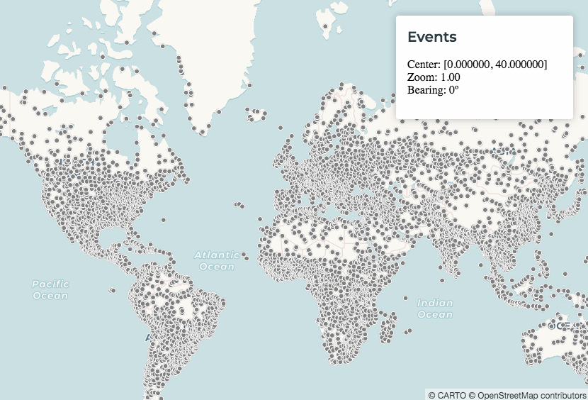
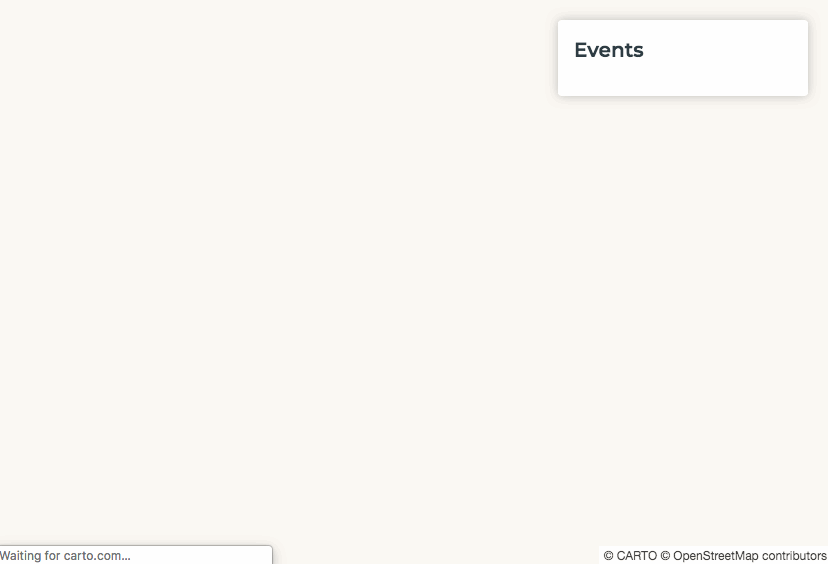
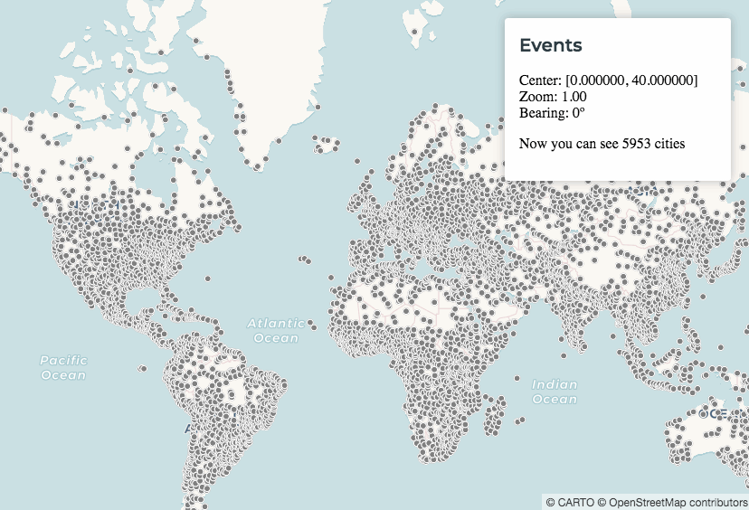
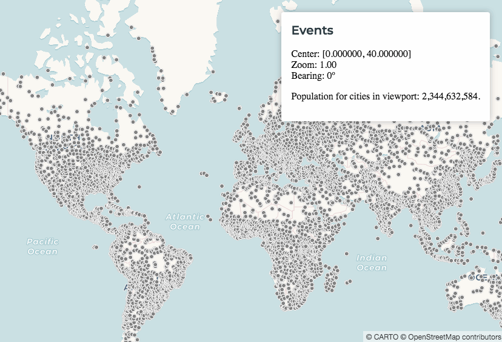
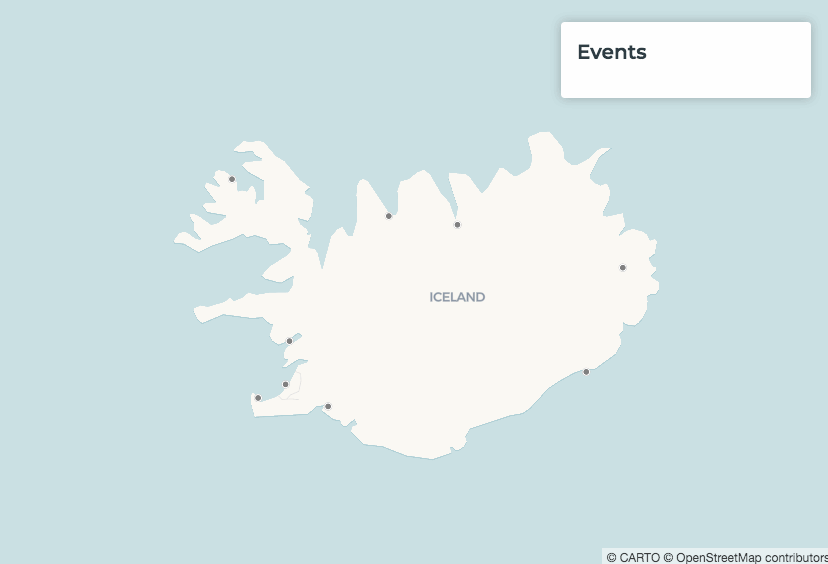
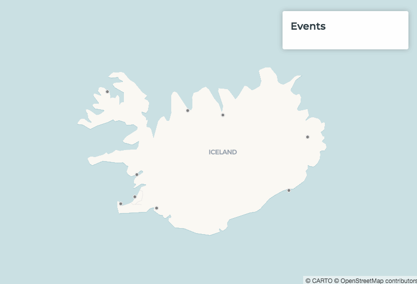
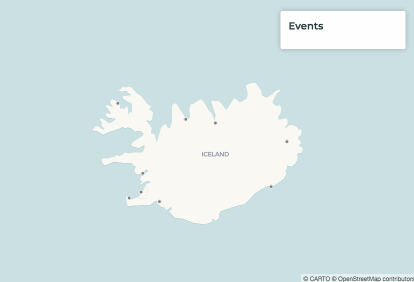

## Intro to Interactivity and Events

*One of the most useful features of CARTO maps is that they're interactive. When users click on a map, or pan it, or hover over it's features, we can cause another action to happen in the map. For example, we can open a Pop-Up window, or change the color of a feature to highlight it.* 

*In this section we will cover different types of interactivity and how you can use them to highlight your data. We also have a guide for this [here](https://carto.com/developers/carto-vl/guides/add-interactivity-and-events/).*

### Create a Basic Map

Let's create a new map using world population data.

1. Paste this into your index.html document:

    ```
    <!DOCTYPE html>
    <html>

    <head>
        <title>CARTO VL training</title>
        <meta name="viewport" content="width=device-width, initial-scale=1.0">
        <meta charset="UTF-8">
        <!-- Include CARTO VL JS from the CARTO CDN-->
        <script src="https://libs.cartocdn.com/carto-vl/v1.0.0/carto-vl.min.js"></script>
        <!-- Include Mapbox GL from the Mapbox CDN-->
        <script src="https://api.tiles.mapbox.com/mapbox-gl-js/v0.50.0/mapbox-gl.js"></script>
        <link href="https://api.tiles.mapbox.com/mapbox-gl-js/v0.50.0/mapbox-gl.css" rel="stylesheet" />
        <!-- Include CARTO styles-->
        <link href="https://carto.com/developers/carto-vl/examples/maps/style.css" rel="stylesheet">
    </head>

    <body>
        <div id="map"></div>
        <script>
            const map = new mapboxgl.Map({
                container: 'map',
                style: carto.basemaps.voyager,
                center: [0, 40],
                zoom: 1
            });

            carto.setDefaultAuth({
                user: 'cartovl',
                apiKey: 'default_public'
            });

            const source = new carto.source.Dataset('populated_places');
            const viz = new carto.Viz(`
                color: grey
                width: 6
            `);
            const layer = new carto.Layer('layer', source, viz);

            layer.addTo(map);
        </script>
    </body>

    </html>
    ```

The first step to making something happen when a user interacts with the map is detecting that user's action. In the following sections we will show you the ways CARTO VL "listens" for these events.

### Map Events

CARTO VL can detect events that happen in the map object.

2. Add this under `<div id="map"></div>` to add an overlay box. We are setting this up to show basic information about our map, in the paragraph element with `desc` id.

    ```
    <aside class="toolbox">
        <div class="box">
            <header>
                <h1>Events</h1>
            </header>
            <section>
                <p id="desc"></p>
            </section>
        </div>
    </aside>
    ```

    Next we will set up some variables to hold the basic information about our map.

3. Paste this under your `const layer = new carto.Layer('layer', source, viz);` line:

    ```
    function desc() {
        const center = map.getCenter();
        const longitude = center.lng.toFixed(6);
        const latitude = center.lat.toFixed(6);
        const bearing = map.getBearing().toFixed(0);
        const zoom = map.getZoom().toFixed(2);
        document.querySelector('#desc').innerHTML = `Center: [${longitude}, ${latitude}]<br/>Zoom: ${zoom}<br/>Bearing: ${bearing}º`;
    }
    ```

    The functions we're using to define these variables come from Mapbox GL. We can use them since our CARTO VL map is based on a Mapbox GL map object.
    * `center` will contain the coordinates of the map's center point, based on it's bounding box.
        * [getCenter](https://www.mapbox.com/mapbox-gl-js/api/#lnglatbounds#getcenter)
    * `longitude` will contain the `center` longitude.
    * `latitude` will contain the `center` latitude.
    * `bearing` will contain the current compass "up" direction, in degreees. 0 means "up" is North.
        * [getBearing](https://www.mapbox.com/mapbox-gl-js/api/#map#getbearing)
    * `zoom` will contain the map's current zoom level.
        * [getZoom](https://www.mapbox.com/mapbox-gl-js/api/#map#getzoom)
    * The last line displays the information from our variables in the overlay box we created in the last step.

    Now we just need to run the `desc` function, to detect the information we will display in our overlay. 

4. Add these lines beneath the code block you added in the last step:

    ```
    map.on('load', desc);
    map.on('move', desc);
    ```

    * We already defined `map` as the name of our map object. 
    * [load](https://www.mapbox.com/mapbox-gl-js/api/#map.event:load) is a Mapbox GL function that will detect when the map loads in a browser.
    * [move](https://www.mapbox.com/mapbox-gl-js/api/#map.event:move) is a Mapbox GL function that will detect when a map user moves the map, for example by panning.

    When you save these changes and open index.html in a web browser your map should look like this. Notice how the overlay values change as we pan the map.

    

For more information about map events check [this section](https://carto.com/developers/carto-vl/guides/add-interactivity-and-events/#map-events) of our *Add interactivity and events* guide.

### Basic Layer Events

Events that happen in certain layers in your map are also detectable. We use CARTO VL library functions for this, as opposed to Mapbox-specific functions.

5. Add this code block underneath `map.on('move', desc);`

    ```
    layer.on('loaded', function() {
        document.querySelector('#layer-desc').innerText = `Layer loaded!`;
    });
    ```

    * Once our map layer is finished loading, we are running a function that displays a new message in our overlay.
    * `.on('loaded'` is documented [here]](https://carto.com/developers/carto-vl/reference/#cartoon)

    

Layer events are described in [this guide section](https://carto.com/developers/carto-vl/guides/add-interactivity-and-events/#layer-events).

### Exposing Properties and Features with Variables

Let's use a Layer Event to get useful information about our layer's data. To do that we're going to use variables, [as explained in this guide](https://carto.com/developers/carto-vl/guides/add-interactivity-and-events/#using-variables).

6. Add a variable to our `viz` that retrieves our layer's features:

    ```
    const viz = new carto.Viz(`
        @currentFeatures: viewportFeatures()
        color: grey
        width: 6
    `);
    ```

    * [viewportFeatures](https://carto.com/developers/carto-vl/reference/#cartoexpressionsviewportfeatures) is a CARTO VL function that gets a list of features within the map view bounds.

    Since the variable returns a list, we can count how many items are in the list. That means we can display our layer's feature count in our overlay.

7. Replace your `layer.on('loaded'` code block with this:

    ```
    layer.on('updated', function() {
        const numberOfFeatures = viz.variables.currentFeatures.value.length;
        document.querySelector('#layer-desc').innerText = `Now you can see ${numberOfFeatures} cities`;
    });
    ```

    * Now when any update is made to our layer (like when we zoom in our out), the features within the viewport will found via `viewportFeatures`. 
    * Then those features will be counted by `viz.variables.currentFeatures.value.length`. 
    * We store the number of features in the `numberOfFeatures` const.
    * Then we put that in a ${variable} so we can use it in text for our overlay. 

    

### Access Results from Functions

We can get more information from our layer besides a list of features. CARTO VL offers functions like [viewportSum](https://carto.com/developers/carto-vl/reference/#cartoexpressionsviewportsum) that can be applied to a numeric column in your dataset. Then we can use that sum in a layer event.

You can find a list of viewport-based functions [here](https://carto.com/developers/carto-vl/reference/#cartoexpressionsviewportavg).

8. Make a new variable in your `viz`, like this:

    ```
    const viz = new carto.Viz(`
        @total_pop: viewportSum($pop_max)
        color: grey
        width: 6
    `);
    ```

    * We have a column in our dataset that contains a maximum population number for each point: `pop_max`.
    * `viewportSum` is finding the pop_max values for each point that falls inside the map's bounds, and adding those together.

9. Replace your `layer.on('updated'` function with this:

    ```
    layer.on('updated', function() {
        document.querySelector('#layer-desc').innerText = `Population for cities in viewport: ${viz.variables.total_pop.value.toLocaleString()}.`;
    });
    ```

    * When the layer gets updated (for example on zoom), we are using `viz.variables.total_pop.value` to get the total pop_max number and converting it to text with `toLocaleString()`. That way we can display it in our overlay's text.

    

### Feature Events

So far we've listened for events from our map, and from it's layer. We can also listen for events related a layer's features. For example, we can detect when a user clicks on a point, or hovers over it.

The first step to using feature events is to enable your map layer to capture user actions. We do that in CARTO VL by adding an [interactivity object](https://carto.com/developers/carto-vl/reference/#cartointeractivity). 

Find a list of Feature Events you can use [here](https://carto.com/developers/carto-vl/guides/add-interactivity-and-events/#feature-events).

10. Paste this underneath `const layer = new carto.Layer('layer', source, viz);`:

    ```
    const interactivity = new carto.Interactivity(layer);
    ``` 

    * an interactivity object can be added to a single map layer or to an array of multiple layers.

    Let's add `viz` variables to contain useful information about the features our users will interact with.

11. Replace your `viz` with this:

    ```
    const viz = new carto.Viz(`
        @total_pop: viewportSum($pop_max)
        @name: $name
        @pop_max: $pop_max
        color: grey
        width: 6
    `);
    ```

    * `@name` and `pop_max` will contain values from those dataset columns for each feature.

    Now let's set up a function that detects when a user clicks on a point in our layer.

12. Add this code block under `const interactivity = new carto.Interactivity(layer);`

    ```
    interactivity.on('featureClick', featureEvent => {
        const features = document.querySelector('#features');
        features.innerHTML = '';
        featureEvent.features.forEach((feature) => {
            const name = feature.variables.name.value;
            const pop_max = feature.variables.pop_max.value;
            features.innerHTML += `<li>${name}: ${pop_max.toLocaleString()}</li>`;
        });
    });
    ```

    * Read more about [featureClick](https://carto.com/developers/carto-vl/reference/#cartointeractivityfeatureclick) in our documentation.
    * When a point is clicked, the `featureEvent => {...}` function runs.
        * It runs through each feature and detects which one was clicked in the `forEach` function.
        * Then it finds the `name` and `pop_max` variable values for that feature and displays them in our overlay.

    

### Adding Mapbox GL Pop-Ups

We can use a feature event to open a Pop-Up window, to display useful information about that feature. Since we're using a Mapbox GL map object, we can use a [Mapbox GL Pop-Up](https://www.mapbox.com/mapbox-gl-js/api/#popup) for this. 

Review [this guide section](https://carto.com/developers/carto-vl/guides/add-interactivity-and-events/#adding-pop-ups) for more information about adding Pop-Ups.

13. We are going to add new code underneath the `forEach` function we used in the last step. Use this for your `featureClick` code block:

    ```
    interactivity.on('featureClick', featureEvent => {
        const features = document.querySelector('#features');
        features.innerHTML = '';
        featureEvent.features.forEach((feature) => {
            const name = feature.variables.name.value;
            const pop_max = feature.variables.pop_max.value;
            features.innerHTML += `<li>${name}: ${pop_max.toLocaleString()}</li>`;
        });

        const feature = featureEvent.features[0];
        if (!feature) {
            return;
        }
        const coords = featureEvent.coordinates;
        const html = `
            <h1>${feature.variables.name.value}</h1>
            <p>Population: ${feature.variables.pop_max.value.toLocaleString()}</p>
        `;
        new mapboxgl.Popup()
            .setLngLat([coords.lng, coords.lat])
            .setHTML(html)
            .addTo(map);
    });
    ```

    * `const feature` [references an array of our map layer's features](https://carto.com/developers/carto-vl/reference/#featureevent).
    * `if(!feature)` basically detects if the place on the map you clicked *doesn't* contain a point. In that case we won't open a Pop-Up.
    * `const coords` [gets the latitude & longitude coordinates of the feature you clicked on](https://carto.com/developers/carto-vl/reference/#featureevent)
    * `const html` creates the structure of our Pop-Up. These are the HTML elements that will display our feature's `name` and`pop_max` values.
    * `mapboxgl.Popup()` has other functions chained to it that define where to place the Pop-Up on the map, define which HTML elements to use in it, and add it to the map object.

    

### Interactive-Based Styling

In addition to displaying useful information about a feature when a user interacts with it, we can change what the feature looks like to highlight it.

For our last map we will use layer events that capture when a user rolls over a feature, and rolls out. Check out another example with an explanation [in this guide](https://carto.com/developers/carto-vl/guides/add-interactivity-and-events/#interactive-based-styling).


14. Under your `featureClick` code block, add this:

    ```
    interactivity.on('featureEnter', featureEvent => {
        featureEvent.features.forEach((feature) => {
            feature.color.blendTo('rgba(0, 255, 0, 0.8)', 100);
            feature.width.blendTo(12, 100);
        });
    });
    ```

    * `featureEnter` detects when a user's cursor enters the feature, then it runs the `featureEvent` function.
    * Inside the `featureEvent` function, we use the `forEach` function to cycle through features in the dataset and detect which one the user interacted with.
    * Once the feature has been detected we change it's [color and width](https://carto.com/developers/carto-vl/reference/#cartoexpressions) properties.
        * The [blendTo function](https://carto.com/developers/carto-vl/reference/#expressionblendto) transitions the feature from it's current color and width to the new color and width we're defining with expressions. 
        * `100` is the time it takes for that transition to happen, in milliseconds.

15. Underneath the block we just added, add another block to transition the feature back to it's original state when the user's cursor leaves it:

    ```
    interactivity.on('featureLeave', featureEvent => {
        featureEvent.features.forEach((feature) => {
            feature.color.reset();
            feature.width.reset();
        });
    });
    ```

    * We don't need to use `blendTo` here and redefine the width and color to change back to. Instead we can just use [reset](https://carto.com/developers/carto-vl/reference/#feature).

    Here's what our final map looks like. Try rolling over features in your version.

    